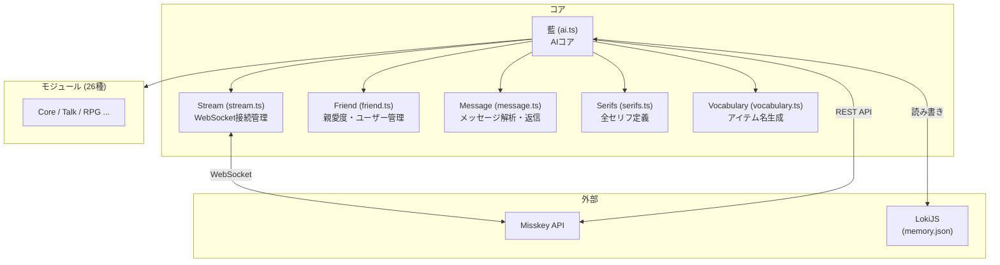
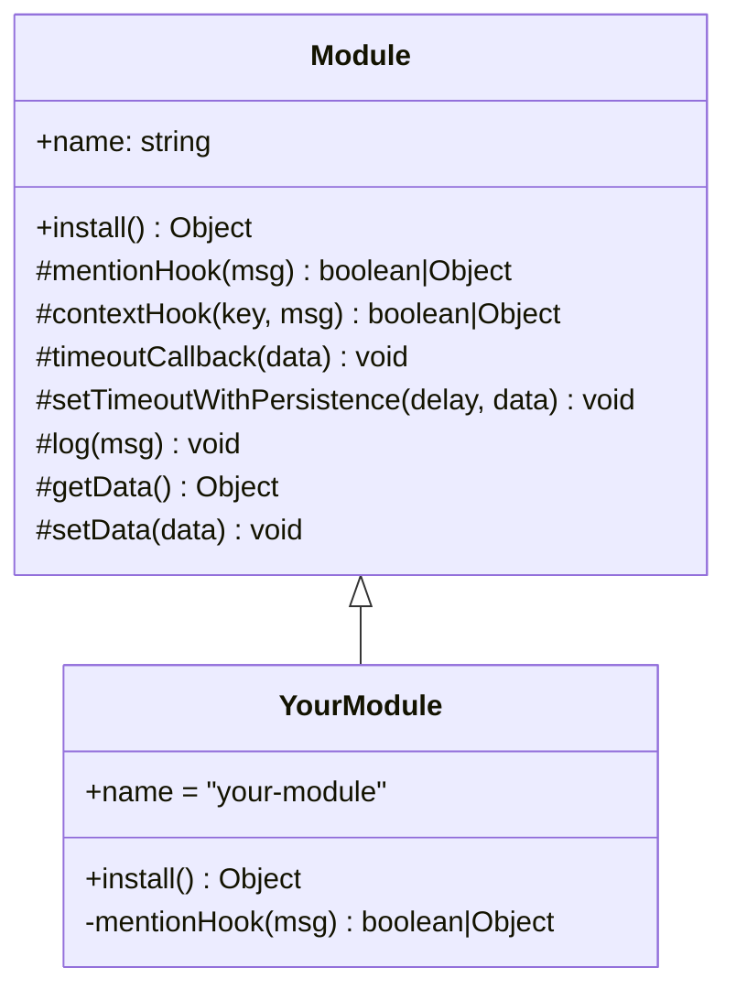
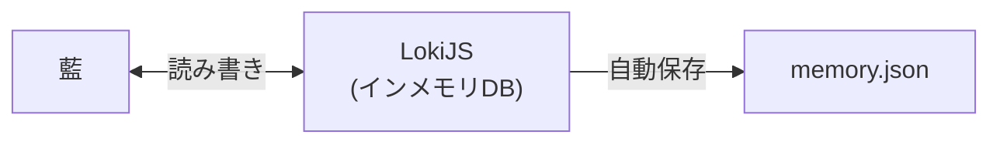
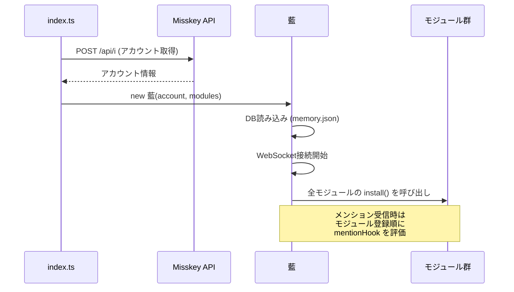
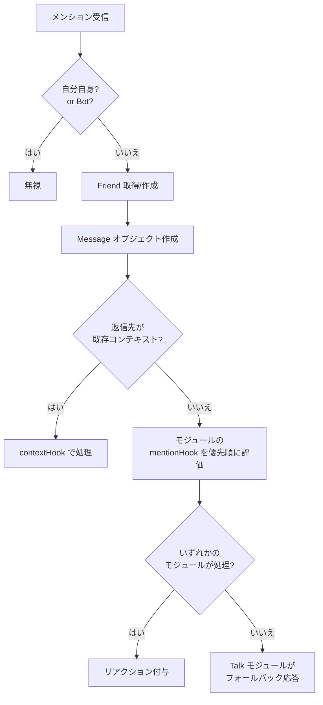

# 藍 (ai)


An Ai for Misskey. [About Ai](./torisetu.md)

## これなに

Misskey用の日本語Botです。  
ユーザーとの対話、ゲーム、占い、サーバー監視など多彩な機能を持つAIアシスタントとして動作します。

---

## インストール

### 必要なもの

| 必要なもの | 必須 | 備考 |
| --- | --- | --- |
| Node.js | ✅ | — |
| npm | ✅ | — |
| MeCab | ❌ | キーワード学習機能を使う場合のみ |

### 手順

```bash
# 1. クローン
git clone <repository_url>
cd ai

# 2. 設定ファイルを作成
cp config.example.json config.json  # または手動で作成

# 3. 依存関係のインストール
npm install

# 4. ビルド
npm run build

# 5. 起動
npm start
```

### 設定ファイル (config.json)

#### 必須設定

| キー | 型 | 説明 |
| --- | --- | --- |
| `host` | string | インスタンスのURL（`https://` 付き、末尾の `/` は除く） |
| `i` | string | 藍として動かしたいアカウントのアクセストークン |

#### 基本設定

| キー | 型 | デフォルト | 説明 |
| --- | --- | --- | --- |
| `master` | string | — | 管理者のユーザー名 |
| `instanceName` | string | `もこきー` | インスタンス名 |
| `memoryDir` | string | `.` | `memory.json` の保存先 |

#### 機能ON/OFF

| キー | 型 | デフォルト | 説明 |
| --- | --- | --- | --- |
| `notingEnabled` | boolean | `true` | ランダムノート投稿 |
| `keywordEnabled` | boolean | `false` | キーワード学習（MeCab必要） |
| `chartEnabled` | boolean | `true` | チャート投稿 |
| `reversiEnabled` | boolean | `false` | リバーシ（reversi-service と対局） |
| `serverMonitoring` | boolean | `false` | サーバー監視 |

#### リバーシ（reversi-service）設定

リバーシを有効にするには、次の 4 つをすべて設定する必要がある（`reversiEnabled` に加え、下記 3 つ）。

| キー | 型 | 説明 |
| --- | --- | --- |
| `reversiServiceWsUrl` | string | reversi-service の WebSocket URL（例: `wss://example.com/api/reversi/stream`） |
| `reversiServiceApiUrl` | string | reversi-service の HTTP API ベース URL（例: `https://example.com`）。invite/create 等に使用 |
| `reversiServiceToken` | string | **reversi-service の session Cookie の値**（下記の取得手順を参照） |

**reversiServiceToken の取得手順**:

1. ブラウザで reversi-service の MiAuth ログインを行う（reversi-service のログイン URL にアクセスし、Misskey で認証する）。
2. ログイン完了でリダイレクトされた後、ブラウザの開発者ツール（F12）を開く。
3. **Application**（または **ストレージ**）→ **Cookies** → reversi-service のドメインを選択。
4. 名前が **`session`** の Cookie の**値**をコピーする。
5. その値を `reversiServiceToken` にそのまま設定する。

#### 投稿設定

| キー | 型 | デフォルト | 説明 |
| --- | --- | --- | --- |
| `postNotPublic` | boolean | `true` | 全公開投稿を禁止 |
| `defaultVisibility` | string | `public` | 主に使用する公開範囲 |
| `randomPostLocalOnly` | boolean | `true` | ランダム投稿をローカル限定 |
| `randomPostChannel` | string | — | ランダム投稿先チャンネルID |
| `birthdayPostLocalOnly` | boolean | `true` | 誕生日祝いをローカル限定 |
| `birthdayPostChannel` | string | — | 誕生日祝い投稿先チャンネルID |

#### MeCab設定

| キー | 型 | 説明 |
| --- | --- | --- |
| `mecab` | string | MeCab のインストールパス |
| `mecabDic` | string | MeCab の辞書ファイルパス |

#### RPG設定

| キー | 型 | デフォルト | 説明 |
| --- | --- | --- | --- |
| `rpgHeroName` | string | `もこチキ` | 主人公の名前 |
| `rpgCoinName` | string | `もこコイン` | 通貨の名前 |
| `rpgCoinShortName` | string | `コイン` | 通貨の短縮名 |
| `rpgReplyRequired` | boolean | `true` | 返信必須にする |
| `rpgReplyVisibility` | string | — | RPGの返信の公開範囲 |
| `rpgRaidReplyVisibility` | string | — | レイドの返信の公開範囲 |

#### その他

| キー | 型 | 説明 |
| --- | --- | --- |
| `forceRemoteChartPostCount` | boolean | チャートからの投稿数取得を強制 |
| `kazutoriWinDiffReverseEnabled` | boolean | 数取りで勝利数差による反転判定を有効化 |
| `kazutoriBanUsers` | string[] | 数取りに参加できないユーザのIDリスト |

#### 設定例

```json
{
  "host": "https://example.com",
  "i": "your-access-token",
  "master": "admin",
  "notingEnabled": true,
  "keywordEnabled": false,
  "chartEnabled": true,
  "reversiEnabled": false,
  "reversiServiceWsUrl": "wss://your-reversi-service.example.com/api/reversi/stream",
  "reversiServiceApiUrl": "https://your-reversi-service.example.com",
  "reversiServiceToken": "",
  "serverMonitoring": false,
  "mecab": "/usr/local/bin/mecab",
  "mecabDic": "/usr/lib/mecab/dic/",
  "memoryDir": "."
}
```

---

## Dockerで動かす

```bash
# 1. クローン＆設定
git clone <repository_url>
cd 
# config.json を作成（MeCab設定・memoryDir は触らない）

# 2. ビルド＆起動
docker-compose build
docker-compose up
```

Docker用の設定例:

```json
{
  "host": "https://example.com",
  "i": "your-access-token",
  "master": "admin",
  "notingEnabled": true,
  "keywordEnabled": true,
  "chartEnabled": true,
  "reversiEnabled": false,
  "serverMonitoring": false,
  "mecab": "/usr/bin/mecab",
  "mecabDic": "/usr/lib/x86_64-linux-gnu/mecab/dic/mecab-ipadic-neologd/",
  "memoryDir": "data"
}
```

> `docker-compose.yml` の `enable_mecab` を `0` にすると、MeCab をインストールしないようにできる（メモリが少ない環境向け）。

---

## フォント

一部の機能（迷路、チャート等）にはフォントが必要です。  
藍にはフォントは同梱されていないので、インストールディレクトリに `font.ttf` という名前で設置してください。

---

## 開発

### ビルド & テスト

```bash
npm install
npm run build   # TypeScript → JavaScript
npm test        # Jest テスト実行
npm start       # 起動
```

### アーキテクチャ概要



### ディレクトリ構造

```text
ai/
├── src/
│   ├── ai.ts          # AIコアクラス（藍）
│   ├── config.ts      # 設定ファイル読み込み
│   ├── friend.ts      # ユーザー情報・親愛度管理
│   ├── index.ts       # エントリーポイント（起動処理）
│   ├── message.ts     # メッセージ解析・返信
│   ├── module.ts      # モジュール基底クラス
│   ├── serifs.ts      # 全セリフ定義
│   ├── stream.ts      # WebSocket ストリーム接続
│   ├── vocabulary.ts  # アイテム名生成用語彙
│   ├── misskey/       # Misskey API の型定義
│   ├── modules/       # 各機能モジュール（26種）
│   ├── types/         # 外部ライブラリ型定義
│   └── utils/         # ユーティリティ関数群
├── test/              # テストコード
├── config.json        # 設定ファイル（要作成）
├── torisetu.md        # 取扱説明書（ユーザー向け）
├── Dockerfile         # Docker 用設定
└── docker-compose.yml # Docker Compose 設定
```

### コアファイルの役割

| ファイル | 責務 |
| --- | --- |
| `ai.ts` | WebSocket購読、メンション振り分け、Friend管理、API呼び出し、activeFactor管理 |
| `friend.ts` | ユーザーごとの親愛度・名前・最終アクセス管理。DB (LokiJS) で永続化 |
| `message.ts` | 受信メッセージのラッパー。テキスト正規化・返信・リアクション付与 |
| `module.ts` | 全モジュールの基底クラス。フック登録・永続タイマー・ログ出力を提供 |
| `stream.ts` | WebSocket接続管理。メイン/ローカルTL/ホームTL/チャンネルの4種のストリーム |
| `serifs.ts` | 全モジュールのセリフをオブジェクトリテラルで集約 |
| `vocabulary.ts` | ランダムなアイテム名を生成（色×素材×アイテムの組み合わせ） |
| `config.ts` | `config.json` を読み込み、APIのURL等を計算して公開 |

### モジュールの追加方法

1. `src/modules/<module-name>/index.ts` を作成
2. `Module` 基底クラスを継承
3. `install()` メソッドでフックを登録
4. `src/index.ts` のモジュール配列に追加（順序 = 優先度）



### フックの種類

| フック | 用途 | 登録方法 |
| --- | --- | --- |
| `mentionHook` | メンションに応答 | `install()` の返り値に含める |
| `contextHook` | 会話の文脈に応答 | `msg.reply()` でコンテキスト登録 |
| `timeoutCallback` | タイマー完了時の処理 | `install()` の返り値に含める |

### データの永続化

藍は **LokiJS**（インメモリDB）を使用してデータを管理している。



| コレクション | 内容 |
| --- | --- |
| `friends` | 全ユーザーの親愛度、名前、最終アクセスなど |
| `moduleData` | モジュール固有の永続データ（タイマー、誤差補正値等） |
| `_keyword_learnedKeywords` | keyword モジュールが学習したキーワード |
| その他 | 各モジュールが `getCollection()` で作成したコレクション |

---

## 起動フロー



---

## メッセージ処理フロー

メンションやリプライを受信した際の処理:



---

## 搭載モジュール一覧

モジュールは登録順（上から順）に mentionHook が評価される。先頭のモジュールほど優先度が高い。

### 対話・コア機能

| モジュール | 説明 | トリガー |
| --- | --- | --- |
| [Core](src/modules/core/index.ts) | 名前設定、好感度確認、ステータス表示、アカウントリンク | メンション |
| [Talk](src/modules/talk/README.md) | 会話応答全般（挨拶、なでなで、好き、罵って等） | メンション |
| [Ping](src/modules/ping/README.md) | `ping` → `PONG!` の死活確認 | メンション |

### ゲーム

| モジュール | 説明 | トリガー |
| --- | --- | --- |
| [RPG](src/modules/rpg/index.ts) | RPGゲーム（戦闘・アイテム・レイド） | メンション |
| [Kazutori](src/modules/kazutori/README.md) | 数取りゲーム（複数人参加） | メンション |
| [Reversi](src/modules/reversi/README.md) | リバーシ対局 | メンション |
| [GuessingGame](src/modules/guessing-game/README.md) | 数当てゲーム | メンション |
| [Maze](src/modules/maze/README.md) | 迷路生成（難易度調整可） | メンション |
| [Dice](src/modules/dice/README.md) | サイコロ / YES・NO質問 / ファクトチェック | メンション |

### エンターテイメント

| モジュール | 説明 | トリガー |
| --- | --- | --- |
| [Fortune](src/modules/fortune/README.md) | おみくじ（63種の結果、日替わり） | メンション |
| [Emoji](src/modules/emoji/README.md) | 手+顔の顔文字ランダム生成 | メンション |
| [EmojiReact](src/modules/emoji-react/README.md) | リアクション自動付与 | TLノート |
| [Timer](src/modules/timer/README.md) | タイマー（最大30日、永続化対応） | メンション |

### 定期実行・自動投稿

| モジュール | 説明 | タイミング |
| --- | --- | --- |
| [Today](src/modules/today/README.md) | 暦情報（祝日・記念日・六曜等）投稿 | 毎日8時以降 |
| [Yoruho](src/modules/yoruho/README.md) | 夜報を0:00:00に精密投稿 | 毎日0時 |
| [Noting](src/modules/noting/README.md) | ランダムつぶやき投稿 | 5分間隔で確率判定 |
| [Chart](src/modules/chart/README.md) | インスタンス統計チャート | 定期 |
| [SleepReport](src/modules/sleep-report/README.md) | 起動時に停止時間を「睡眠時間」として報告 | 起動時 |

### ユーザー関連

| モジュール | 説明 | タイミング |
| --- | --- | --- |
| [Welcome](src/modules/welcome/README.md) | 新規ユーザーの初投稿祝い＋キリ番通知 | ローカルTL監視 |
| [Follow](src/modules/follow/README.md) | フォローバック＋リモートフォロー自動解除 | メンション / ホームTL |
| [Birthday](src/modules/birthday/README.md) | 誕生日祝い（DM or 公開投稿） | 3分間隔で確認 |
| [Valentine](src/modules/valentine/README.md) | 2月14日にチョコメッセージ送信 | 3分間隔（2/14のみ） |

### 学習・記録・管理

| モジュール | 説明 | タイミング |
| --- | --- | --- |
| [Keyword](src/modules/keyword/README.md) | TLからキーワードを学習（MeCab使用） | TL監視 |
| [Reminder](src/modules/reminder/README.md) | リマインダー機能（12時間おきに催促） | メンション |
| [Poll](src/modules/poll/README.md) | アンケート結果通知 | メンション |
| [Server](src/modules/server/README.md) | サーバーCPU/メモリ監視・管理者通知 | リアルタイム |

---

## 親愛度システム

友達（ユーザー）ごとに「親愛度（love）」を管理している。親愛度は対話や挨拶で増減し、様々な機能のしきい値に使われる。

### 親愛度レベル

★の表示は `core/index.ts` で計算される。各★の点灯閾値:

| ★ | 閾値 | 親愛度範囲 | 主な解放機能 |
| --- | --- | --- | --- |
| ★1 | -29以上 | -29〜-11 | （マイナスでも最低限の★はつく） |
| ★2 | -10以上 | -10〜-1 | — |
| ★3 | 0以上 | 0〜4 | 基本応答、誕生日祝い(DM) |
| ★4 | 5以上 | 5〜19 | バレンタインチョコ |
| ★5 | 20以上 | 20〜49 | 公開誕生日祝い、キリ番通知 |
| ★6 | 50以上 | 50〜99 | — |
| ★7 | 100以上 | 100〜 | 呼び名20文字まで、RPG行動回数増加 |

> 補足:
>
> - ★7以上はオーバーフローで `★★★★★★★+` のように表示される。
> - 親愛度の最低値は **-30**。名前設定やリモートフォロバは親愛度 **10以上** が必要。

### 増減ルール

`incLove` / `decLove` は入力値を **内部で5倍** して適用する。

| アクション | 実効値 | 条件 |
| --- | --- | --- |
| 挨拶（おはよう、こんにちは等） | 3 | 1日1回まで |
| メンション応答（モジュールが正しく応答した時） | 0.5 | 同種は10分に1回 |
| 通知受信（リアクション・引用・投票） | 0.5 | 同種は10分に1回 |
| RPG | 0.5 | 1日1回 |

#### 1日の上限

| 親愛度 | 1日の増加上限 |
| --- | --- |
| 100未満 | 15 |
| 100以上 | 50 |

#### 親愛度100以上での軽減

親愛度が100を超えると、増減量に軽減がかかる:

```text
実効値 = 入力値 × 5 / (親愛度 × 2 / 100 - 1)
```

親愛度が高いほど1回あたりの増減量が小さくなる仕組み。

#### x00到達ボーナス

親愛度が100, 200, 300... を超えた時に感謝メッセージが送信され、RPGの行動回数が+1される。

---

## ライセンス

MIT

## Awards


