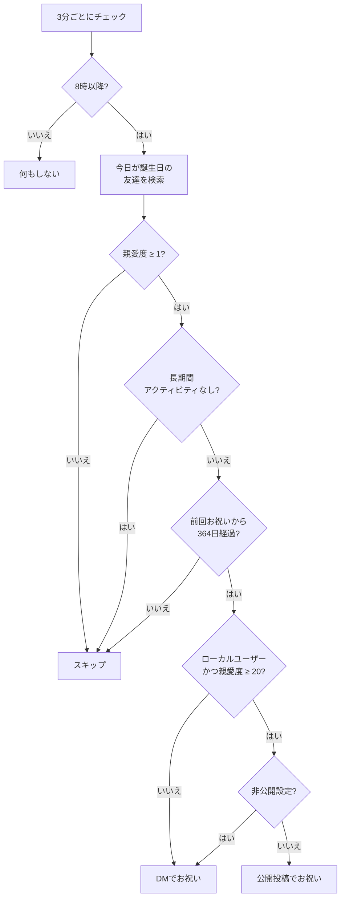

# birthday

友達の誕生日をチェックし、お祝いメッセージを送るモジュール。

## 動作フロー

## 仕様

| 項目 | 内容 |
| --- | --- |
| トリガー | 3分間隔のポーリング（8時以降のみ） |
| 重複防止 | モジュール固有データ `lastBirthdayChecked` に日付を記録 |
| 頻度制限 | 前回お祝いから364日以上経過が必要 |
| 使用フック | なし（`install()` でタイマー設定） |

### お祝い方法

| 条件 | 方法 |
| --- | --- |
| ローカルユーザー + 親愛度≥20 + 公開設定 | **公開投稿**で祝う |
| ローカルユーザー + 親愛度≥20 + 非公開設定 | **DM**で祝う |
| リモートユーザー or 親愛度<20 | **DM**で祝う |

### スキップ条件（詳細）

| 条件 | 理由 |
| --- | --- |
| 親愛度 < 1 | まだ十分な関わりがない |
| 親愛度 < 100 かつ 最後の親愛度増加から31日以上経過 | ほぼアクティブでないユーザー |
| 親愛度 ≥ 100 かつ 最後の親愛度増加から364日以上経過 | 長期離脱ユーザー |
| 前回のお祝いから364日未満 | 年1回まで |

### 設定

| 設定キー | 説明 |
| --- | --- |
| `config.birthdayPostLocalOnly` | 公開投稿をローカル限定にする |
| `config.birthdayPostChannel` | 公開投稿の投稿先チャンネルID |
