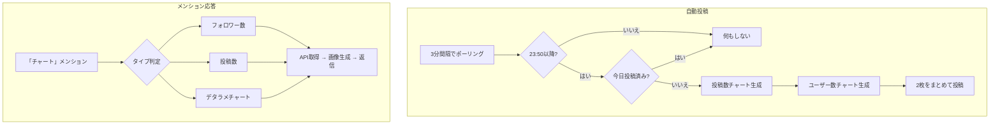

# chart モジュール

Misskey の統計APIからデータを取得して棒グラフ画像を生成・投稿するモジュール。

---

## 処理フロー

---

## チャートタイプ

| タイプ | トリガー | データソース | データ系列 |
|---|---|---|---|
| `notes` | 自動投稿 | `charts/notes` | 通常/リプライ/リノート/ファイル付き |
| `users` | 自動投稿 | `charts/active-users` + `charts/users` | 読み書き/閲覧のみ/非アクティブ/新規 |
| `userNotes` | 「投稿」メンション | `charts/user/notes` | 個人の投稿数4系列 |
| `followers` | 「フォロワー」メンション | `charts/user/following` | ローカル/リモート |
| `random` | その他のメンション | ランダム生成 | 1〜3系列のランダムデータ |

---

## メンションコマンド

| 入力例 | 結果 |
|---|---|
| `@藍 チャート` | デタラメチャート（ランダムタイトル） |
| `@藍 チャート りんご` | タイトル「りんごの売り上げ」等のデタラメチャート |
| `@藍 チャート 投稿` | 自分の投稿数チャート（30日分） |
| `@藍 チャート フォロワー` | 自分のフォロワー数チャート（30日分） |

---

## ファイル構成

| ファイル | 行数 | 責務 |
|---|---|---|
| `index.ts` | 200行 | モジュール本体。チャートタイプ判定・API取得・投稿 |
| `render-chart.ts` | 216行 | Canvas で棒グラフ画像を描画 |

---

## 画像仕様 (render-chart.ts)

| 項目 | 値 |
|---|---|
| サイズ | 1280×768 px |
| フォント | `font.ttf`（カスタムフォント） |
| 背景色 | `#434343`（ダークグレー） |
| データ色 | 赤 / 黄緑 / 水色 / オレンジ / 黄色 |
| Y軸 | 自動スケール（niceScale アルゴリズム） |

---

## 依存関係

| 依存先 | 用途 |
|---|---|
| `canvas` | チャート画像の描画 |
| `@/vocabulary` | デタラメチャートのタイトル素材 |
| `@/utils/check-ng-word` | タイトルのNGワード判定 |
| `@/serifs` | 投稿セリフ（通常/年末） |
