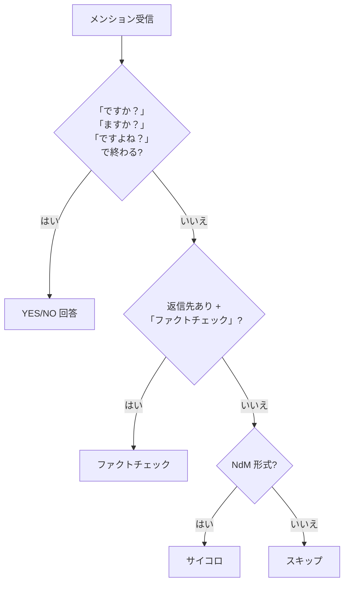
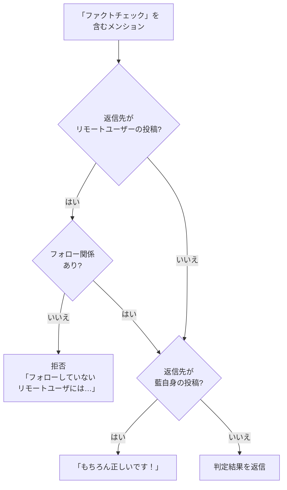

# dice

サイコロ、YES/NO質問回答、ファクトチェックの3機能を提供するモジュール。

## 機能一覧

---

## 1. YES/NO 質問

「ですか？」「ますか？」「ですよね？」で終わるメンションに対して、はい/いいえを返答する。

| 回答 | 確率 | 例 |
|---|---|---|
| はい | 25% | 「はい」 |
| 多分はい、部分的にはい | 25% | 「多分はい、部分的にはい」 |
| いいえ | 25% | 「いいえ」 |
| 多分いいえ、部分的にいいえ | 25% | 「多分いいえ、部分的にいいえ」 |

> **特徴:** `seedrandom` を使用し、同じ質問テキストには常に同じ回答を返す。

---

## 2. ファクトチェック

返信先の投稿に対して「正しい」「嘘」を判定する。

| 判定結果 | 確率 |
|---|---|
| 正しいかも | 25% |
| 多分正しい、部分的に正しい | 25% |
| 嘘かも | 25% |
| 多分嘘、部分的に嘘 | 25% |

> **特徴:** 投稿IDをシードにし、同じ投稿には常に同じ判定を返す。

---

## 3. サイコロ

`NdM` 形式（例: `2d6`）でサイコロを振る。

| 入力例 | 意味 | 出力例 |
|---|---|---|
| `1d6` | 6面ダイスを1回 | `3` |
| `2d6` | 6面ダイスを2回 | `3 5 (合計: 8)` |
| `3d100` | 100面ダイスを3回 | `42 78 13 (合計: 133)` |

### 制限

| 項目 | 制限値 |
|---|---|
| 最小回数 | 1 |
| 最小面数 | 2 |
| 最大面数 | `Number.MAX_SAFE_INTEGER` |
| 結果文字列の長さ | 7,000文字以内 |

## 仕様

| 項目 | 内容 |
|---|---|
| 使用フック | `mentionHook` のみ |
| リアクション | 全機能共通で `:love:` |
| 公開範囲 | `public` |
