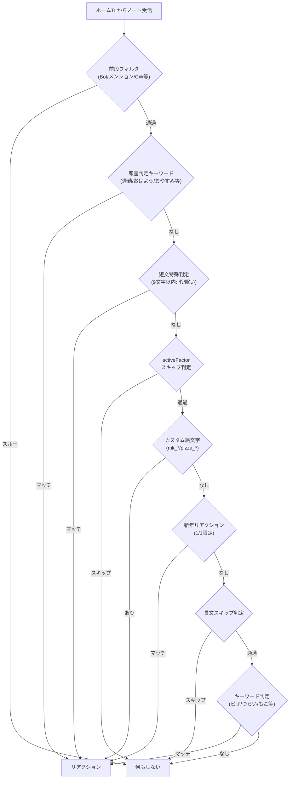

# emoji-react モジュール

ホームTLのノートを監視し、キーワードや絵文字に応じて自動でリアクションを付けるモジュール。

---

## 判定フロー

---

## 前段フィルタ

| 条件 | 動作 |
| --- | --- |
| Botのノート | スルー |
| 他者へのリプライ | スルー |
| テキストなし | スルー |
| `@` を含む（メンション） | スルー |
| フォロワー限定 + CW付き | スルー |
| CW付き（空白CW / 50%確率） | スルー |
| フォロワー限定（50%確率） | スルー |

---

## リアクション一覧

### 即座判定（activeFactor 不問）

| トリガー | リアクション | 文字数制限 |
| --- | --- | --- |
| 退勤 / しごおわ | `:otukaresama:` | — |
| おはよう / ぽきた | `:mk_oha:` | ≤30文字 |
| おやすみ / ぽやしみ | `:oyasumi2:` | ≤30文字 |
| ひま（短文） | `:mkchicken_myonmyon:` | ≤9文字 |
| ねむい / すや（短文） | 時刻対応絵文字 | ≤9文字 |
| こんにちは | `:konnichiha(_2)_irasutoya:` | ≤30文字 |
| こんばんは | `:konbanha(_2)_irasutoya:` | ≤30文字 |

### キーワード判定（activeFactor 依存）

| トリガー | リアクション | 備考 |
| --- | --- | --- |
| ピザ | `:itspizzatime:` | — |
| カンピロバクター | `:campylobacter_mottenaidesu:` | — |
| つらい / しんどい / 帰りたい | `:mkchicken_petthex:` | MeCab確認あり |
| 無意味なもの | `:osiina:` | — |
| 宝くじ当選 | `:201000000000:` | — |
| もこもこ | `:mokomoko:` | — |
| 滅 | `:metu:` | 「滅茶」「滅多」除外 |
| 伸び | `:mk_ultrawidechicken:` | MeCab確認あり |
| 嘘 | `:sonnano_uso:` | 50%、≤30文字 |
| もこ | `:mk_chicken_t:` 等 | ランダム3種から選択 |
| 新年（1/1限定） | `:supertada:` | — |

---

## 待機時間の計算

| 要素 | 効果 |
| --- | --- |
| 基本 | 3.5秒 |
| CW付き | +2秒 |
| テキスト長（30文字超） | +0.1秒/文字（最大+6.8秒） |
| 親愛度 | 好感度1あたり0.2%短縮（最大20%短縮） |
| activeFactor | 低いほど遅延増加（`0.6/activeFactor`倍） |
| ランダム揺らぎ | 計算した待機時間にさらにランダム幅を加算 |

---

## 1日あたりのリアクション制限

同一ユーザーへの1日のリアクション回数が3回を超えると、回数増加に応じて確率的にスキップ。

- スキップ確率: `1 - 0.7^((回数-2)/2)`

---

## 依存関係

| 依存先 | 用途 |
| --- | --- |
| `timeout-as-promise` | 待機時間のPromise化 |
| `@/modules/keyword/mecab` | MeCab による形態素解析（キーワード確認） |
| `@/utils/japanese` | 半角→全角、カタカナ→ひらがな変換 |
| `@/utils/includes` | テキスト内キーワード検索 |
| `@/stream` | WebSocketストリーム接続 |
