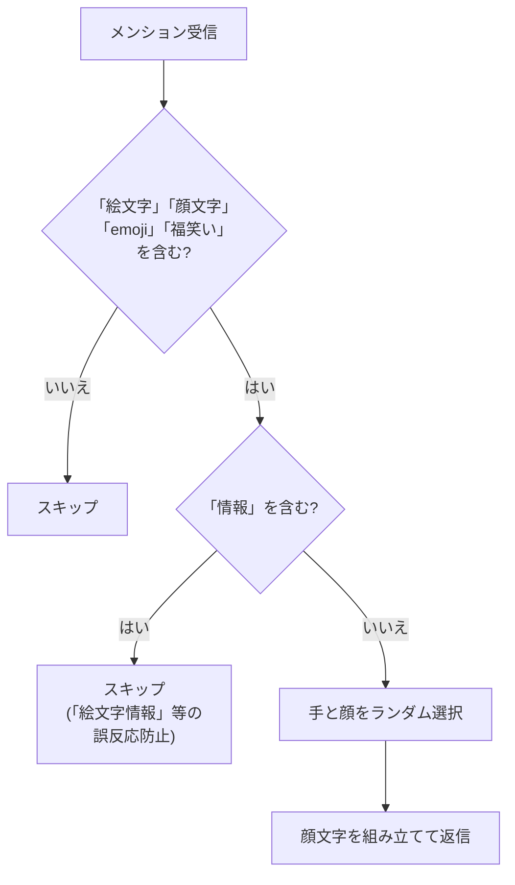

# emoji

ランダムな手と顔の絵文字を組み合わせた顔文字を生成して返信するモジュール。

## 動作フロー



## 仕様

| 項目 | 内容 |
| --- | --- |
| トリガー | メンションに `顔文字`, `絵文字`, `emoji`, `福笑い` を含む |
| 除外条件 | テキストに `情報` が含まれる場合はスキップ |
| リアクション | `:love:` |
| 公開範囲 | `public` |
| 使用フック | `mentionHook` のみ |

### 顔文字の組み立て

手の絵文字（27種）と顔の絵文字（90種）をランダムに組み合わせる。

```text
手 + 顔 + 手  →  👊😎👊
```

手の絵文字には**左右ペア**のものもある:

```text
左手 + 顔 + 右手  →  🤛😄🤜
```

### 出力例

| 手のタイプ | 例 |
| --- | --- |
| 単体（左右同じ） | ✌😄✌ |
| ペア（左右異なる） | 🤛😎🤜 |
| ペア（左右異なる） | 💪🤩✌ |

### 素材数

| 素材 | 種類数 |
| --- | --- |
| 手の絵文字 | 27種（うち5種がペア） |
| 顔の絵文字 | 90種 |
| 組み合わせ数 | **2,430通り** |
