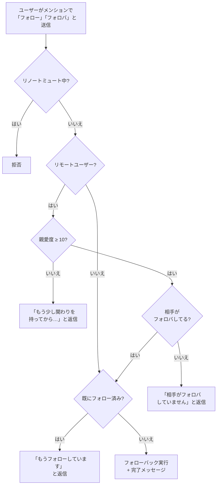
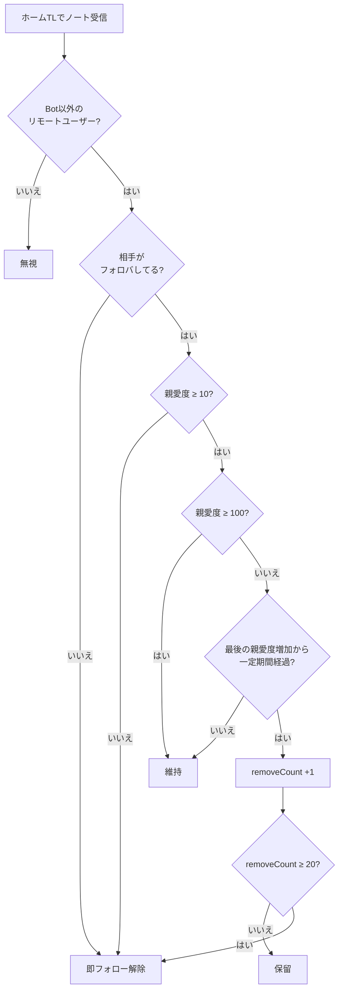

# follow

フォローバック管理と、条件を満たさないリモートフォローの自動解除を行うモジュール。

## 機能概要

1. **フォローバック**: メンションで「フォロー」と言われたらフォローバックを実行
2. **自動フォロー解除**: ホームTLを監視し、条件を満たさないリモートユーザーのフォローを段階的に解除

---

## 1. フォローバック

### フォローバック条件まとめ

| 条件 | ローカルユーザー | リモートユーザー |
| --- | --- | --- |
| 親愛度制限 | なし | 10以上必要 |
| 相手のフォロバ | 不問 | 必要 |
| リノートミュート中 | 拒否 | 拒否 |

---

## 2. 自動フォロー解除

ホームTLのノートを監視し、リモートユーザーのフォロー状態を定期的にチェックする。

### フォロー解除条件

| 条件 | アクション |
| --- | --- |
| 相手がフォロバしていない | 即解除 |
| 親愛度10未満 | 即解除 |
| 親愛度10〜99 + 一定期間アクティビティなし | `removeCount` を蓄積。20回で解除 |
| 親愛度100以上 | 解除しない |

### 猶予期間の計算

アクティビティがないと判定される期間（猶予期間）:

| 親愛度 | 猶予期間 |
| --- | --- |
| 10〜49 | `親愛度 × 0.3日` |
| 50〜99 | `親愛度 × 0.3日 × 2`（2倍の猶予） |

例: 親愛度30 → 9日間アクティビティがないと removeCount が蓄積開始
