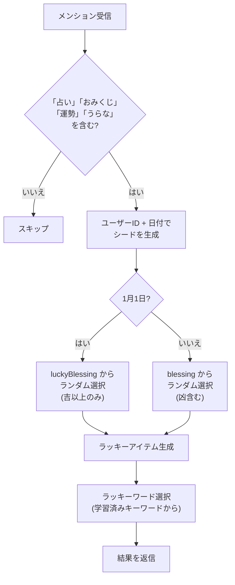

# fortune

おみくじ機能を提供するモジュール。SI接頭辞や漢数字の単位で「吉」のスケールを表現するユニークなおみくじ。

## 動作フロー



## 仕様

| 項目 | 内容 |
| --- | --- |
| トリガー | メンションに `占`, `うらな`, `運勢`, `おみくじ` を含む |
| リアクション | `:love:` |
| 公開範囲 | `public` |
| 使用フック | `mentionHook` のみ |

### 同じ日・同じユーザーには同じ結果

`seedrandom` を使い、シード `年/月/日@ユーザーID` で乱数を生成する。  
そのため、同じユーザーが同じ日に何度おみくじを引いても、同じ結果が返る。

---

## おみくじ結果

63種類の結果がある。上位ほどレアで良い結果。

### レア枠（上位4種）

| 結果 |
| --- |
| スーパーもこもこ吉🎉 |
| スーパーもこ吉🎉 |
| もこもこ吉🎉 |
| もこ吉🎉 |

### 漢数字単位枠（20種）

不可説不可説転吉 → googol吉 → 無量大数吉 → ... → 万吉

### SI接頭辞枠（20種）

クエタ吉 → ヨタ吉 → ... → デカ吉 → 吉 → デシ吉 → ... → クエクト吉

### 普通枠（6種）

| 結果 |
| --- |
| 超吉🎉 |
| 大大吉🎉 |
| 大吉🎉 |
| まあまあ吉🎉 |
| 中吉🎉 |
| 小吉🎉 |

### 凶枠（3種）

| 結果 |
| --- |
| ふつう |
| 凶 |
| 大凶 |

> **1月1日は特別:** 凶が出ない `luckyBlessing`（35種）を使用する。

---

## おみくじの返信内容

```text
[名前]のおみくじの結果は…
**ギガ吉🎉** (\(10^9\))
ラッキーアイテム: 金のサイコロ
ラッキーワード: プログラミング
```

| 要素 | ソース |
| --- | --- |
| おみくじ結果 | `blessing` / `luckyBlessing` 配列 |
| ラッキーアイテム | `genItem()` で生成 |
| ラッキーワード | keyword モジュールの学習済みキーワードからランダム選択 |
