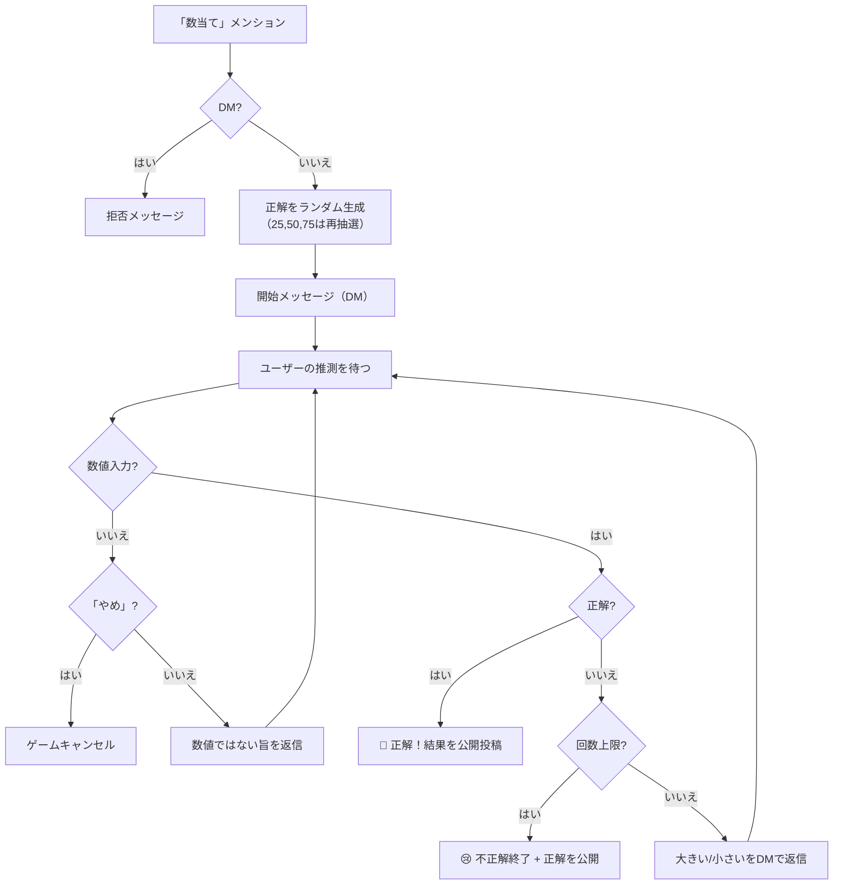

# guessing-game モジュール

0〜99のランダムな数を6回以内に当てる数当てゲーム。

---

## ゲームフロー

---

## ゲームルール

| 項目 | 値 |
| --- | --- |
| 正解の範囲 | 0〜99 |
| 最大推測回数 | 6回 |
| 回避される初期値 | 25, 50, 75（中央値付近を避ける） |
| ゲーム中の会話 | DM（specified） |
| 結果発表 | ゲーム開始ノートへの公開返信 |

---

## 特殊仕様

| 仕様 | 説明 |
| --- | --- |
| 範囲外補正 | 既知の上限/下限を超えた入力値は自動的に範囲内に補正される |
| 最終回救済 | 残り1回で候補が2個に絞られている場合、ユーザーの入力に合わせて正解を変更する |
| 正解コメント | 1回: 「エスパー」 / 3回以内: 「すごい」 / 4回以内: 「早い」 |

---

## 依存関係

| 依存先 | 用途 |
| --- | --- |
| `lokijs` | ゲームデータの永続化 |
| `@/serifs` | ゲームセリフ（`serifs.guessingGame.*`） |
| `@/utils/acct` | 結果投稿時のメンション |
