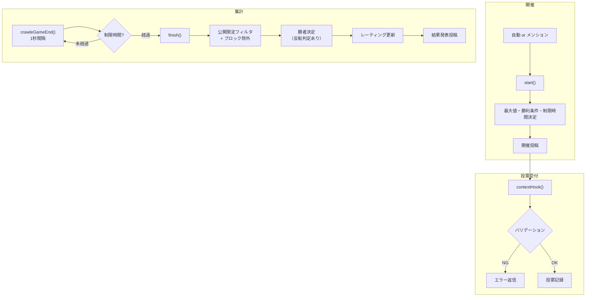

# kazutori モジュール

数取りゲーム — ユーザーが数字を1つ投票し、重複しない最大値を選んだ人が勝利するゲーム。
レーティングシステムにより、勝者は敗者からレートを吸収する。

---

## 処理フロー

---

## 勝利条件

| 条件 | 説明 | 選択確率 |
|---|---|---|
| 最大値 | 重複しない最も大きい数字を選んだ人が勝ち | デフォルト |
| 2番目に大きい値 | 2番目に大きい数字が勝ち | 15%（無限モード時30%） |
| 中央値 | 有効投票の中央値に最も近い数字が勝ち | 15%（無限モード時30%） |

### 反転モード

勝利条件により 15% または 30% の確率（通常 15%、2番目/中央値勝利時は 30%）で結果が反転し、**昇順で判定される**（最小値が勝ち）。
勝利数差が大きい場合、初心者側に有利な反転補正が入ることがある。

---

## 特殊モード

| モード | 確率 | 説明 |
|---|---|---|
| 巨大数 | 3% | 最大値が50〜500倍に |
| Max1 | 2% | 最大値が1（0か1しか選べない） |
| 無限 | 3% | 最大値無制限（Decimal.MAX_VALUE） |
| 公開限定 | 0.5% | 公開/ホーム投稿のみ有効 |
| フォロワー限定 | 3% | 開催投稿がフォロワー限定 |
| 長時間 | 0.1% | 制限時間が48倍に |
| トロフィー戦 | 自動 | 勝利数50超の参加者が多い場合に発動 |

### 特殊日

| 日付 | 効果 |
|---|---|
| 1/1 | 最大値が年数になる |
| 4/1 | 反転モードがさらに反転する |

---

## 制限時間

| 条件 | 時間 |
|---|---|
| 通常 | 5分 or 10分 |
| 短縮（10%） | 1分 or 2分 |
| 長時間 | ×48倍 |
| activeFactor低下時 | 延長される |

---

## レーティングシステム

- 初期レート: **1000**
- 勝者: 敗者から吸収したレートの合計を獲得
- 敗者: レートの一定割合を失う（制限時間に比例）
- 順位が上位の敗者ほど減少量が軽減される（最大50%減）
- 不参加者: レート1000超過分にペナルティ（レートが高いほど重い）
- 表示上限: 9999

---

## メンションコマンド

| コマンド | 権限 | 説明 |
|---|---|---|
| 数取り | 誰でも | ゲーム開催リクエスト |

### クールタイム

基本30分。親愛度に応じて短縮:
- love ≥ 200: ×1.2
- love ≥ 100: ×1.5
- love ≥ 20: ×2
- love ≥ 5: ×4
- love < 5: ×8

フォロワー限定/DM経由の場合はさらに×1.5。

---

## 設定 (config.json)

| キー | 型 | デフォルト | 説明 |
|---|---|---|---|
| `kazutoriWinDiffReverseEnabled` | boolean | `false` | 勝利数差による反転モード確率変動（補正）を有効にするか |
| `kazutoriBanUsers` | string[] | `[]` | 数取りへの参加・開催を禁止するユーザーID/ユーザー名/acctのリスト（大文字小文字無視） |

---

## ファイル構成

| ファイル | 説明 |
|---|---|
| `index.ts` | ゲームロジック本体（開催・投票・集計） |
| `rate.ts` | レーティングデータ管理（型定義・正規化） |

---

## 依存関係

| 依存先 | 用途 |
|---|---|
| `break_infinity.js` | 巨大数の処理（Decimal型） |
| `lokijs` | ゲームデータの永続化 |
| `@/vocabulary` | 勝利アイテムの生成 |
| `@/serifs` | 投稿セリフ |
| `@/friend` | ユーザーデータ・レーティング管理 |
