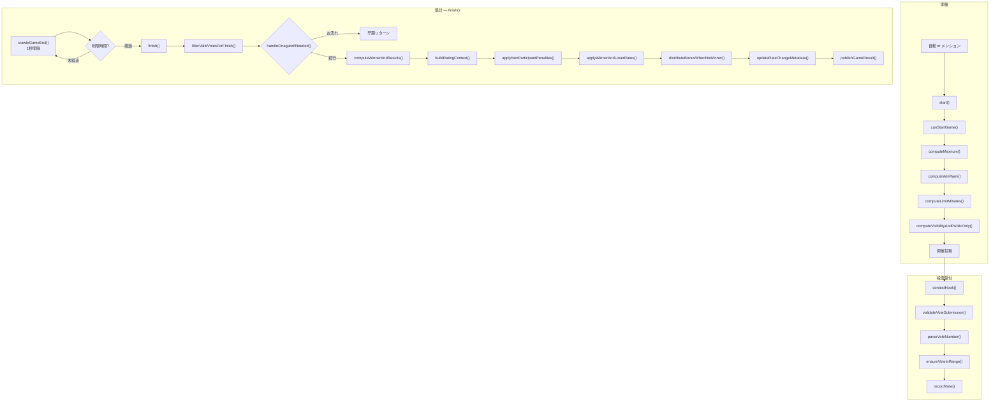

# kazutori モジュール

数取りゲーム — ユーザーが数字を1つ投票し、重複しない最大値を選んだ人が勝利するゲーム。
レーティングシステムにより、勝者は敗者からレートを吸収する。

---

## 処理フロー

---

## 勝利条件

| 条件 | 説明 | 選択確率 |
| --- | --- | --- |
| 最大値 | 重複しない最も大きい数字を選んだ人が勝ち | デフォルト |
| 2番目に大きい値 | 2番目に大きい数字が勝ち | 15%（無限モード時30%） |
| 中央値 | 有効投票の中央値に最も近い数字が勝ち | 15%（無限モード時30%） |

### 反転モード

勝利条件により 15% または 30% の確率（通常 15%、2番目/中央値勝利時は 30%）で結果が反転し、**昇順で判定される**（最小値が勝ち）。
勝利数差が大きい場合、初心者側に有利な反転補正が入ることがある。

---

## 特殊モード

| モード | 確率 | 説明 |
| --- | --- | --- |
| 巨大数 | 3% | 最大値が50〜500倍に |
| Max1 | 2% | 最大値が1（0か1しか選べない） |
| 無限 | 3% | 最大値無制限（Decimal.MAX_VALUE） |
| 公開限定 | 0.5% | 公開/ホーム投稿のみ有効 |
| フォロワー限定 | 3% | 開催投稿がフォロワー限定 |
| 長時間 | 0.1% | 制限時間が48倍に |
| トロフィー戦 | 自動 | 勝利数50超の参加者が多い場合に発動 |

### 特殊日

| 日付 | 効果 |
| --- | --- |
| 1/1 | 最大値が年数になる |
| 4/1 | 反転モードがさらに反転する |

---

## 制限時間

| 条件 | 時間 |
| --- | --- |
| 通常 | 5分 or 10分 |
| 短縮（10%） | 1分 or 2分 |
| 長時間 | ×48倍 |
| activeFactor低下時 | 延長される |

---

## レーティングシステム

- 初期レート: **1000**
- 勝者: 敗者から吸収したレートの合計を獲得
- 敗者: レートの一定割合を失う（制限時間に比例）
- 順位が上位の敗者ほど減少量が軽減される（最大50%減）
- 不参加者: レート1000超過分にペナルティ（レートが高いほど重い）
- 表示上限: 9999

---

## メンションコマンド

| コマンド | 権限 | 説明 |
| --- | --- | --- |
| 数取り | 誰でも | ゲーム開催リクエスト |

### クールタイム

基本30分。親愛度に応じて短縮:

- love ≥ 200: ×1.2
- love ≥ 100: ×1.5
- love ≥ 20: ×2
- love ≥ 5: ×4
- love < 5: ×8

フォロワー限定/DM経由の場合はさらに×1.5。

---

## 設定 (config.json)

| キー | 型 | デフォルト | 説明 |
| --- | --- | --- | --- |
| `kazutoriWinDiffReverseEnabled` | boolean | `false` | 勝利数差による反転モード確率補正を有効化 |
| `kazutoriBanUsers` | string[] | `[]` | 数取りの参加・開催を禁止するユーザーID/acct一覧（大文字小文字無視） |

---

## ファイル構成

| ファイル | 説明 |
| --- | --- |
| `index.ts` | ゲームロジック本体（開催・投票・集計・レート計算） |
| `rate.ts` | レーティングデータ管理（型定義・正規化・ランク検索） |

---

## index.ts の内部構造

### 型定義

| 型名 | 説明 |
| --- | --- |
| `Vote` | 投票1件分の情報（ユーザー情報 + 投票数値） |
| `Game` | ゲーム1回分の状態（LokiJS コレクションに保存） |
| `KazutoriRatingContext` | finish() のレート計算で使う準備データをまとめた型 |

### ゲーム開始 (`start`)

| メソッド | 説明 |
| --- | --- |
| `canStartGame()` | クールダウン・連続開催制限のチェック |
| `computeMaxnum()` | 最大値の決定（前回参加者数ベース + 特殊モード判定） |
| `computeWinRank()` | 勝利条件の決定（最大値 / 2番目 / 中央値） |
| `computeLimitMinutes()` | 制限時間の決定 |
| `computeVisibilityAndPublicOnly()` | 公開範囲と公開限定モードの決定 |

### 投票受付 (`contextHook`)

| メソッド | 説明 |
| --- | --- |
| `validateVoteSubmission()` | BAN・重複投票・トリガー者制限のチェック |
| `parseVoteNumber()` | テキストから数値を解析（Decimal変換・丸め処理） |
| `ensureVoteInRange()` | 投票数値が 0〜maxnum の範囲内かチェック |
| `recordVote()` | 有効な投票をゲームに記録 |

### 集計 (`finish`)

| メソッド | 説明 |
| --- | --- |
| `filterValidVotesForFinish()` | 公開限定フィルタ・ブロック除外・親愛度チェック |
| `handleOnagareIfNeeded()` | お流れ判定（無効試合なら早期リターン） |
| `computeWinnerAndResults()` | 勝者・結果リスト・反転の計算 |
| `buildRatingContext()` | レート計算の準備データ一式を構築 |
| `applyNonParticipantPenalties()` | 不参加者のレート超過分にペナルティ |
| `applyWinnerAndLoserRates()` | 勝者ボーナス・敗者減算・勝者ステータス更新 |
| `distributeBonusWhenNoWinner()` | 勝者なし時のボーナス配分 |
| `updateRateChangeMetadata()` | レート変動メタデータの反映 |
| `publishGameResult()` | 結果投稿・リプライ購読解除 |

### 共通ヘルパー

| メソッド | 説明 |
| --- | --- |
| `isMedalMatch()` | メダル戦（トロフィー戦）かどうかの判定 |
| `normalizeGameMaxnum()` | maxnum の文字列→Decimal 型正規化 |
| `formatNumberForResult()` | 数値の表示用フォーマット（∞・指数表記の整形） |
| `formatNumberOrSentinel()` | 中央値の表示用文字列（-1→有効数字なし 等） |
| `formatMaxnumForDisplay()` | maxnum の表示文字列（MAX_VALUE→∞ 等） |
| `compareDecimalAsc()` | Decimal 昇順比較 |
| `compareDecimalDesc()` | Decimal 降順比較 |
| `decimalAbs()` | Decimal 絶対値 |
| `compareByRateDesc()` | レートランキングの降順比較 |
| `distributeRemainderToPenalties()` | 端数ポイントの不参加者への返却 |
| `computeMedian()` | 数値配列の中央値計算 |

---

## 依存関係

| 依存先 | 用途 |
| --- | --- |
| `break_infinity.js` | 巨大数の処理（Decimal型） |
| `lokijs` | ゲームデータの永続化 |
| `@/vocabulary` | 勝利アイテムの生成 |
| `@/serifs` | 投稿セリフ |
| `@/friend` | ユーザーデータ・レーティング管理 |
