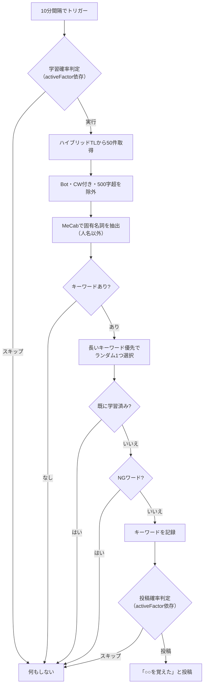

# keyword モジュール

MeCab（形態素解析）を使ってタイムラインから固有名詞を学習し、覚えた単語を投稿するモジュール。

---

## 学習フロー

---

## 設定

| 設定キー | 必須 | 説明 |
| --- | --- | --- |
| `keywordEnabled` | ✅ | `true` でモジュール有効化 |
| `mecab` | ✅ | MeCab 実行ファイルのパス |
| `mecabDic` | ❌ | MeCab 辞書ディレクトリ |
| `mecabCustom` | ❌ | カスタムユーザー辞書（`-u` オプション） |

---

## 学習パラメータ

| パラメータ | 値 |
| --- | --- |
| 学習間隔 | 10分 |
| TL取得件数 | 50件 |
| 対象品詞 | 固有名詞（人名以外） |
| 除外条件 | Bot投稿、ローカル限定、CW付き、500文字超、2桁以上の数字、NGワード |
| 学習確率 | `max(activeFactor, 0.25) / 2` |
| 投稿確率 | activeFactor 0.25未満でさらに間引き |
| 選択バイアス | 長いキーワードが優先される（平方根分布） |

---

## ファイル構成

| ファイル | 責務 |
| --- | --- |
| `index.ts` | 学習ロジック・管理者コマンド |
| `mecab.ts` | MeCab サブプロセスのラッパー |

---

## 依存関係

| 依存先 | 用途 |
| --- | --- |
| `lokijs` | 学習済みキーワードの永続化 |
| `memory-streams` | MeCab の標準出力を読み取り |
| `@/utils/check-ng-word` | NGワード判定 |
| `@/serifs` | 学習報告セリフ |
