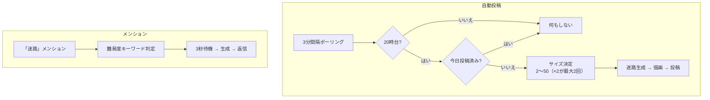

# maze モジュール

迷路画像を生成・投稿するモジュール。毎日20時に自動投稿し、メンションで個別リクエストにも対応。

---

## 処理フロー

---

## 難易度一覧

| 難易度 | トリガーキーワード | サイズ範囲 |
|---|---|---|
| 超接待 | 超接待 / 超超かんたん / (酔っぱらい+接待) | 2〜3 |
| 接待 | 接待 / 超かんたん | 3〜5 |
| 簡単 | 簡単 / かんたん / 易しい / やさしい / 小さい | 8〜15 |
| 普通 | ふつう / 普通 | 11〜31 |
| 難しい | 難しい / むずかしい / 複雑な / 大きい | 22〜34 |
| 鬼 | 死 / 鬼 / 地獄 / 超むずかしい / おに | 40〜59 |
| AI | もこ+本気 / 裏+おに | 100 |
| 指定なし | — | 2〜50（×2が最大2回） |

---

## 特別な日

| 日付 | サイズ |
|---|---|
| 12/31（大晦日） | `年 - 2000`（例: 2026年 → 26） |
| 4/1（エイプリルフール） | 500 |

---

## ファイル構成

| ファイル | 行数 | 責務 |
|---|---|---|
| `index.ts` | 91行 | モジュール本体。投稿・メンション応答 |
| `maze.ts` | 2行 | `CellType` 型定義（17種のセル状態） |
| `gen-maze.ts` | 229行 | 迷路生成アルゴリズム（穴掘り法） |
| `render-maze.ts` | 244行 | Canvas による迷路画像描画 |
| `themes.ts` | 56行 | 9種のカラーテーマ定義 |

---

## 迷路生成アルゴリズム (gen-maze.ts)

- **方式**: 穴掘り法（Recursive Backtracking の変形）
- **シード対応**: `random-seed` ライブラリで決定論的な生成
- **ドーナツ型**: 1/3 の確率で中央にvoid領域（ドーナツ形の迷路）
- **直進モード**: 1/3 の確率で長い直線通路が多くなる

---

## 画像仕様 (render-maze.ts)

| 項目 | 値 |
|---|---|
| 画像サイズ | 4096×4096 px |
| 余白 | 96 px |
| テーマ | 9種（ランダム選択） |
| 出力形式 | PNG |

### カラーテーマ（9種）

各テーマは背景1 / 背景2 / 壁 / 道 / マーカーの5色で構成。

---

## 依存関係

| 依存先 | 用途 |
|---|---|
| `canvas` | 迷路画像の描画 |
| `random-seed` | シード付きランダム生成 |
| `@/serifs` | 投稿セリフ |
