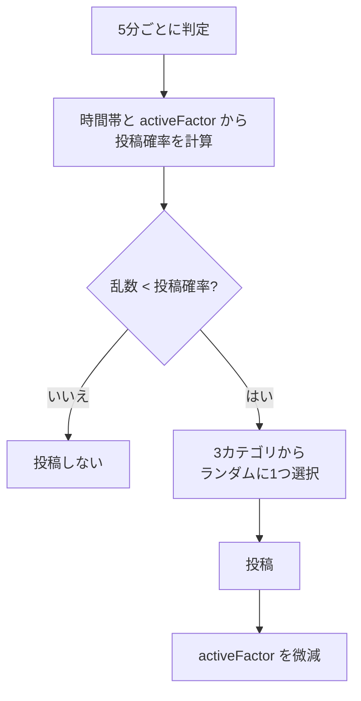
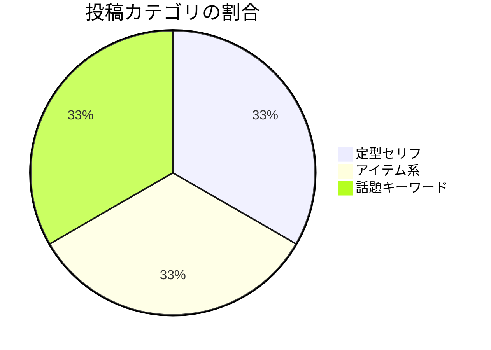

# noting

一定間隔でランダムな「つぶやき」を自動投稿するモジュール。

## 動作フロー

## 仕様

| 項目 | 内容 |
| --- | --- |
| トリガー | 5分間隔の自動判定 |
| 有効条件 | `config.notingEnabled` が `false` でないこと |
| 使用フック | なし（`install()` でタイマー設定のみ） |

### 投稿確率

投稿確率は **時間帯** と **activeFactor** によって変動する。

| 時間帯 | 基本確率 | 計算式 |
| --- | --- | --- |
| 昼 (12時台) | 10% | `0.10 × activeFactor` |
| 夜 (18〜23時台) | 10% | `0.10 × activeFactor` |
| その他 | 2% | `0.02 × activeFactor` |

> **activeFactor** はボットの活動量を調整する係数（0〜2）。  
> 投稿やリアクション応答のたびに減少し、ユーザーとの対話で増加する。

### 投稿カテゴリ

| カテゴリ | 内容 | activeFactor 減少量 |
| --- | --- | --- |
| 定型セリフ | `serifs.noting.notes` からランダム | 0.005 |
| アイテム系 | 「〇〇がほしい」「〇〇を見た」など | 0.01 |
| 話題キーワード | keyword モジュールの学習ワードから話題を生成 | 0.02 |

### 設定

| 設定キー | 説明 |
| --- | --- |
| `config.notingEnabled` | `false` でモジュール無効化 |
| `config.randomPostLocalOnly` | 定型セリフをローカル限定投稿にする |
| `config.randomPostChannel` | 定型セリフの投稿先チャンネルID |
