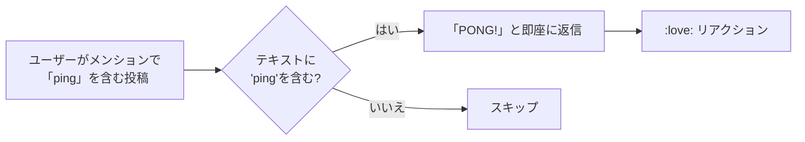

# ping

「ping」に「PONG!」と即座に返信する、死活確認用のシンプルなモジュール。

## 動作フロー

## 仕様

| 項目 | 内容 |
|---|---|
| トリガー | メンションのテキストに `ping` が含まれる |
| 応答 | `PONG!` と返信（即時モード） |
| リアクション | `:love:` |
| 公開範囲 | 元のメッセージに準拠 |
| 使用フック | `mentionHook` のみ |
| コンテキスト | なし |
| タイムアウト | なし |
| DB使用 | なし |

## 用途

ボットが正常に動作しているかを確認するための最小限のモジュール。  
ユーザーが `@bot ping` と送ると、即座に `PONG!` が返ってくることで、ボットの応答可否を確認できる。
