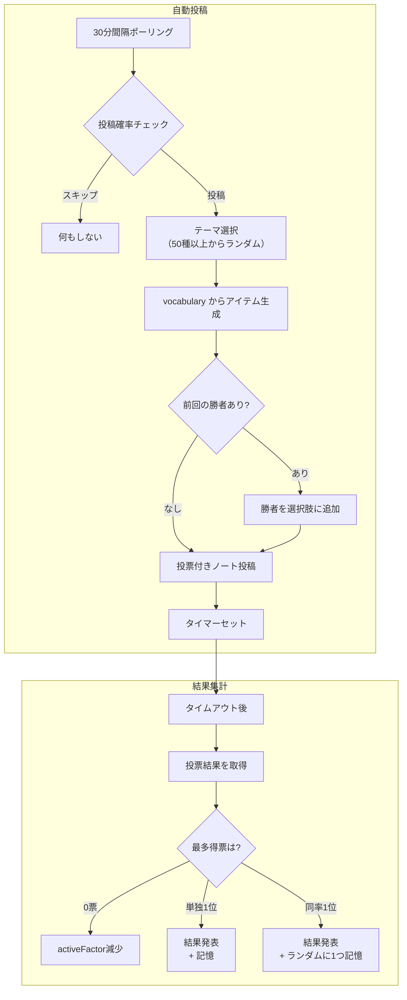

# poll モジュール

ランダムなテーマでアンケートを自動投稿し、結果を集計・記憶するモジュール。

---

## 処理フロー

---

## 投稿タイミング

| 時間帯 | 投稿確率 |
|---|---|
| 0-6時 | 投稿しない |
| 7-11時 | 5% × activeFactor |
| 12時 | 25% × activeFactor |
| 13-16時 | 投稿しない |
| 17-23時 | 25% × activeFactor |
| 12/31 20:00-20:30 | 100%（確定） |

---

## アンケートパラメータ

| 項目 | 通常 | 大晦日 |
|---|---|---|
| 選択肢数 | 4〜9 | 10 |
| 投票受付時間 | 10分（延長あり） | 120分 |
| テーマ | ランダム | 「○○年っぽい響きのもの」 |

### 特殊テーマ

| テーマ名 | 選択肢ソース |
|---|---|
| 好きな絵文字 | インスタンスの絵文字 |
| 面白いバナナス | `makeBananasu()` |

---

## 記憶の仕組み

- 3票以上 or 総投票数 > 選択肢数の場合に結果を記憶
- 同じアイテムが連勝すると `winCount` が増加
- 連勝数が多いほど、次回の選択肢に前回の勝者が混ざりやすくなる
- 過去最高連勝記録は `pollresultlegend` に別途保存

---

## メンションコマンド

| コマンド | 権限 | 説明 |
|---|---|---|
| 覚えた答え | 誰でも | 記憶しているアンケート結果一覧を表示 |

---

## データコレクション

| コレクション名 | 用途 |
|---|---|
| `_poll_pollresult` | 現在の最多得票アイテム・連勝数 |
| `_poll_pollresultlegend` | 過去最高連勝記録 |
| `_poll_ongoingPolls` | 進行中のアンケート管理 |

---

## 依存関係

| 依存先 | 用途 |
|---|---|
| `lokijs` | 結果データの永続化 |
| `@/vocabulary` | 選択肢アイテムの生成 |
| `@/serifs` | 投稿セリフ |
