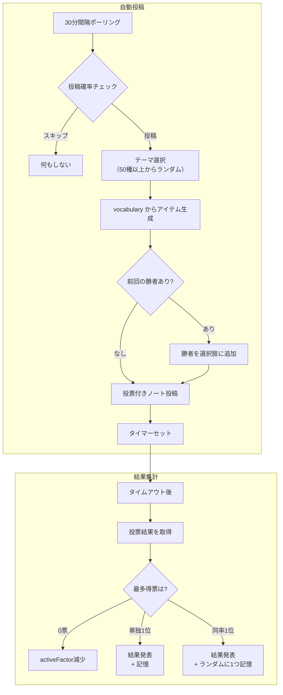

# poll モジュール

ランダムなテーマでアンケートを自動投稿し、結果を集計・記憶するモジュール。

---

## 処理フロー

```mermaid
flowchart TD
    subgraph 自動投稿
        A["30分間隔ポーリング"] --> B{"投稿確率チェック"}
        B -- スキップ --> Z["何もしない"]
        B -- 投稿 --> C["テーマ選択<br/>（50種以上からランダム）"]
        C --> D["vocabulary からアイテム生成"]
        D --> E{"前回の勝者あり?"}
        E -- あり --> F["勝者を選択肢に追加"]
        E -- なし --> G["投票付きノート投稿"]
        F --> G
        G --> H["タイマーセット"]
    end

    subgraph 結果集計
        H --> I["タイムアウト後"]
        I --> J["投票結果を取得"]
        J --> K{"最多得票は?"}
        K -- 0票 --> L["activeFactor減少"]
        K -- 単独1位 --> M["結果発表<br/>+ 記憶"]
        K -- 同率1位 --> N["結果発表<br/>+ ランダムに1つ記憶"]
    end
```

---

## 投稿タイミング

30分ごとに判定する。人数・開催条件の数え方は数取りと共通（`src/utils/timeline-activity.ts`）。

- **確率**: `min(1, 0.02 × activeFactor × (直近60分に HTL/LTL へ3回以上投稿した人数 − 3))`
- **開催条件**: 前回の投稿以降に3回以上投稿した人が5人以上、かつ「100投稿」または「締切から60分」の早いほう。
  今日8時以降にまだ投稿していなければ満たしている扱い。
- **0〜7時**: 投稿しない
- **12/31**: 20:00-20:30 に確定投稿（それ以外の時間は投稿しない）

機嫌0.5で平日1日あたり約2.2回（旧ルールの時間帯別確率と同程度）。

---

## アンケートパラメータ

| 項目 | 通常 | 大晦日 |
| --- | --- | --- |
| 選択肢数 | 4〜9 | 10 |
| 投票受付時間 | 10分（延長あり） | 120分 |
| テーマ | ランダム | 「○○年っぽい響きのもの」 |

### 特殊テーマ

| テーマ名 | 選択肢ソース |
| --- | --- |
| 好きな絵文字 | インスタンスの絵文字 |
| 面白いバナナス | `makeBananasu()` |

---

## 記憶の仕組み

- 3票以上 or 総投票数 > 選択肢数の場合に結果を記憶
- 同じアイテムが連勝すると `winCount` が増加
- 連勝数が多いほど、次回の選択肢に前回の勝者が混ざりやすくなる
- 過去最高連勝記録は `pollresultlegend` に別途保存

---

## メンションコマンド

| コマンド | 権限 | 説明 |
| --- | --- | --- |
| 覚えた答え | 誰でも | 記憶しているアンケート結果一覧を表示 |

---

## データコレクション

| コレクション名 | 用途 |
| --- | --- |
| `_poll_pollresult` | 現在の最多得票アイテム・連勝数 |
| `_poll_pollresultlegend` | 過去最高連勝記録 |
| `_poll_ongoingPolls` | 進行中のアンケート管理 |

---

## 依存関係

| 依存先 | 用途 |
| --- | --- |
| `lokijs` | 結果データの永続化 |
| `@/vocabulary` | 選択肢アイテムの生成 |
| `@/serifs` | 投稿セリフ |
