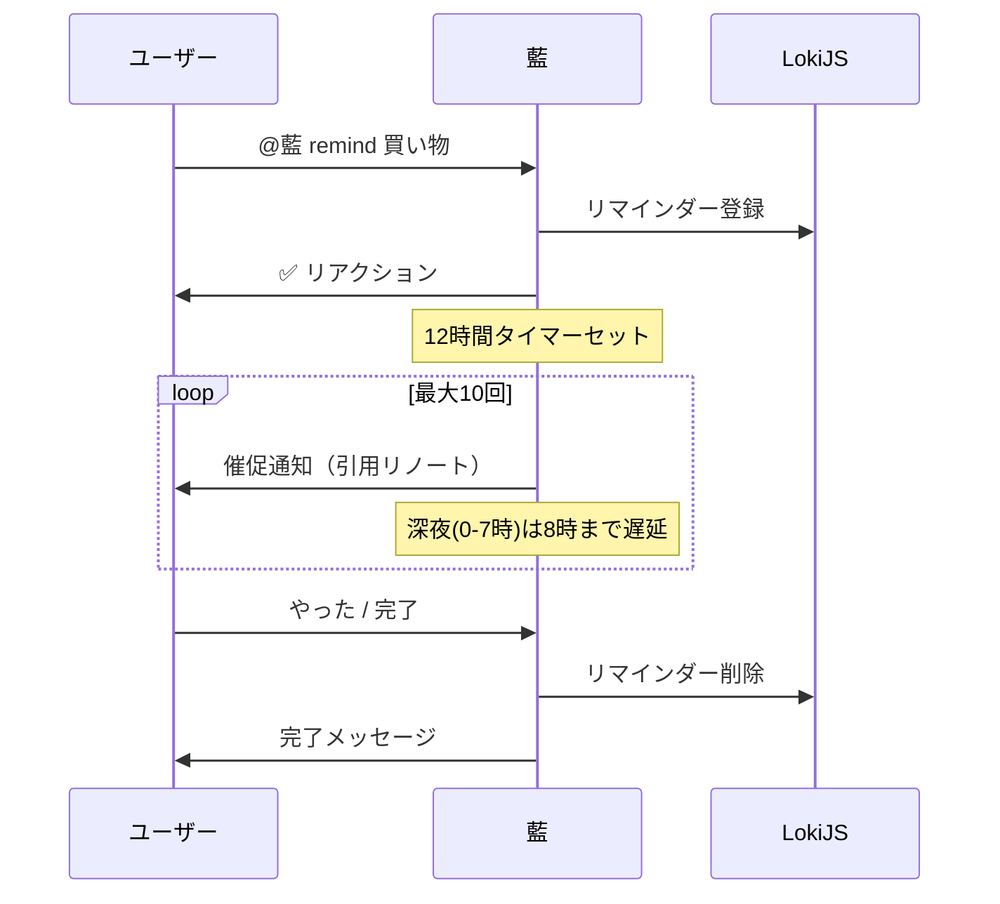

# reminder モジュール

リマインダー（TODO）機能を提供するモジュール。メンションでリマインダーを登録し、定期的に催促通知を送信する。

---

## 処理フロー

---

## コマンド一覧

| コマンド | 説明 | 例 |
| --- | --- | --- |
| `remind <内容>` | テキストリマインダー登録 | `@藍 remind 牛乳を買う` |
| `todo <内容>` | 同上（エイリアス） | `@藍 todo レポート提出` |
| `リマインド <内容>` | 同上（日本語） | `@藍 リマインド 歯医者` |
| `reminds` / `todos` / `リマインド一覧` | 登録済み一覧表示 | `@藍 todos` |
| 引用+`remind` | 引用元ノートをリマインド対象にする | `@藍 remind`（引用付き） |

---

## 完了/キャンセル

催促通知や登録元のノートに返信すると、以下のキーワードで操作できる:

| キーワード | 動作 |
| --- | --- |
| done / やった / やりました / はい / おわった / 終わった / 完了 | リマインダー完了 |
| やめる / やめた / キャンセル | リマインダーキャンセル |

> ⚠️ 登録者本人以外が返信しても操作できない。

---

## 催促ルール

| 項目 | 値 |
| --- | --- |
| 催促間隔 | 約12時間（±50%のランダム幅あり） |
| 最大催促回数 | 10回 |
| 深夜回避 | 0〜7時は催促せず、8時まで遅延 |
| 催促先削除時 | リマインダー自動解除 |

---

## 制限事項

- フォロワー限定メンションからは登録不可
- 内容なし＋引用なしの場合は登録不可
- 永続タイマーを使用するため、Bot再起動後も催促は継続される

---

## 依存関係

| 依存先 | 用途 |
| --- | --- |
| `lokijs` | リマインダーデータの永続化 |
| `@/serifs` | 催促・完了セリフ |
| `@/utils/acct` | メンション用のユーザーアカウント文字列 |
| `@/config` | インスタンスURL（引用リンク生成） |
