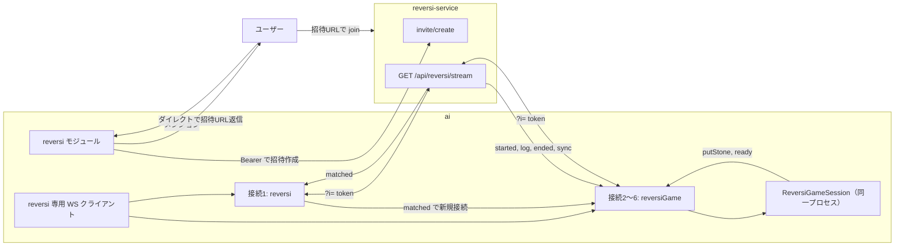

# reversi モジュール

**reversi-service** と対局するリバーシ（オセロ）モジュール。Misskey のリバーシ機能には依存せず、reversi-service に専用の WebSocket / HTTP で接続する。

---

## 有効化条件

次の 4 つがすべて設定されているときのみ有効になる。

- `config.reversiEnabled === true`
- `config.reversiServiceWsUrl`（WebSocket: 例 `wss://example.com/api/reversi/stream`）
- `config.reversiServiceApiUrl`（HTTP: 例 `https://example.com`）
- `config.reversiServiceToken`（MiAuth で取得したセッショントークン）

---

## アーキテクチャ

- **接続**: reversi-service 用の **専用 WebSocket クライアント**（Misskey 用 `Stream` は使わない）。
- **matched 用 1 本**: `reversiServiceWsUrl` に常時 1 本つなぎ、`channel: 'reversi'` に加入。`matched` 受信用。
- **対局用 最大 5 本**: `matched` のたびに新しい WebSocket を 1 本開き、`channel: 'reversiGame', params: { gameId }` に加入。同時対局は最大 5 件。
- **招待**: ユーザーが「リバーシ」等でメンション → `invite/create`（Bearer）で招待URL取得 → **招待を依頼した投稿へダイレクトで返信**して招待URLを送る。ゲーム一覧に登録し、1 時間の時間切れタイマーを 1 回だけセット。
- **切断・復帰**: 対局用接続が切れたら再接続し、サーバーが送る **sync** で盤面・手番を再構築して状態を復帰する。
- **Bot 再起動時**: 永続化されている進行中ゲーム一覧から **reversiGame 接続を自動で張り直す**。接続後にサーバーが送る sync（および必要に応じ started）で盤面・手番を復元し、**自分のターンであれば自動で思考を開始する**。



---

## ファイル構成

| ファイル | 責務 |
| --- | --- |
| `index.ts` | モジュール本体。招待・matched 受信・ゲーム一覧・終局・時間切れ・親愛度・同一プレイヤー制限・勝敗記録（wins/losses）・難易度切り替え（勝ち越し時は単純モード） |
| `reversi-stream.ts` | reversi-service 用 WebSocket クライアント（matched 1 本・対局用最大 5 本） |
| `back.ts` | 思考エンジン（ReversiGameSession: 超単純／単純モード）。started / log / ended / sync 処理。従来の fork 用 Session も残存 |

---

## 思考エンジン

- **有効なモード**: **超単純**と**単純**の 2 種類。どちらを使うかは対戦相手ごとの勝敗記録で自動切り替え。**難易度名はユーザーに表示しない**（投稿・返信では言及しない）。
- **通常モード（αβ）**: 封印（コードは back.ts に残すが、reversi-service 前提では使用しない）。

### モードの切り替え条件

- その対戦相手に対して**プレイヤーが 1 回以上勝ち越している**（勝ち数 > 負け数）とき → **単純モード**。
- それ以外 → **超単純モード**。

勝敗は Friend の永続データ（`reversi.wins` / `reversi.losses`）に記録する。相手が勝ったときのみ `wins` +1、自分勝ち・引き分け・投了はいずれも `losses` +1。

### 超単純モードのルール

1. **隅を取る**: 合法手のうち隅に打てるならそのいずれかを選ぶ。
2. **角周辺回避（条件付き）**: その角がまだ空きのときだけ、その角に隣接するマスを避ける。
3. **候補の絞り込み**: 隅が打てないときは、避ける角周辺に含まれない手を候補。すべて角周辺しかない場合は全合法手を候補に。
4. **X より C を優先**: 角周辺しか打てないとき、C（隅の横／縦隣）に打てる手があればその中で、なければ X（隅の斜め隣）の中で、反転数最大を選ぶ。
5. **反転数最大化**: 候補のうち反転数が最大の手を選ぶ。

### 単純モードの概要

変則ボード対応・未来読みなし・必ず 1 手で着手を決める。現在の盤面と合法手のみを使用する。

- **回避**: 空き角の X → C の順で着手を除外（除外で候補が空になるなら行わない）。
- **優先**: 角 → GoodEdge2（角から 2 マス離れた辺）→ GoodInner（その内側）→ 辺の順で、当たった時点で候補を絞りタイブレークへ。
- **追加回避**: 優先が一度も当たらなかったとき、空き角近く（Nearset）と辺から 1 マス離れた手を回避。
- **タイブレーク**: 空きマス数に応じて反転数最小／最大 → 8 近傍の空きが少ない手 → 辺から遠い手 → ランダム。

角・辺・C/X・GoodEdge2・GoodInner は固定座標を使わず、盤面形状から計算する。

`canPutEverywhere` が true のゲームは対応せず、開始時に終了扱いとする。

---

## 招待・制限

| 項目 | 内容 |
| --- | --- |
| 招待のトリガー | ユーザーが「リバーシ」「オセロ」等でメンション |
| 招待URL | `invite/create` で取得し、**招待を依頼した投稿へダイレクト返信**で送る |
| 招待の有効期限 | 1 時間。期限切れ時はダイレクト返信で時間切れを通知し、今日の対局数に加算 |
| 同時対局 | 最大 5 件。6 件目は「いま忙しいから、あとでまた試してみて」とダイレクト返信で断る |
| 同一プレイヤー | 同じ相手とは同時に 1 対局まで。進行中がある場合は新規招待を断る |
| 1 日あたり | 同じ相手とは 1 日 3 回まで。4 回目以降の招待は断る |

---

## 親愛度・今日の対局数・勝敗

| アクション | 内容 |
| --- | --- |
| 対局終了 | 対戦相手の親愛度を **実効 +1**（`incLove(0.2, 'reversi')`）。**1 日 1 回のみ**（同じ相手に対して）。今日の対局数 +1。勝敗を `reversi.wins` / `reversi.losses` に記録（相手勝ちのみ wins +1、それ以外は losses +1）。 |
| 時間切れ | 今日の対局数 +1。親愛度は変化なし。 |

「今日」の基準はサーバー（藍）の日付（`getDate()`）。

**Friend の reversi 永続データ**: `lastReversiDate`、`gamesPlayedToday`、`lastPlayedAt` に加え、`wins`（その相手に勝った回数）と `losses`（その相手に負けた回数・引き分け・投了を含む）を保持する。難易度切り替え（勝ち越し時は単純モード）に利用する。

---

## 設定例 (config.json)

```json
{
  "reversiEnabled": true,
  "reversiServiceWsUrl": "wss://your-reversi-service.example.com/api/reversi/stream",
  "reversiServiceApiUrl": "https://your-reversi-service.example.com",
  "reversiServiceToken": "reversi-service の MiAuth ログイン後にブラウザに設定される session Cookie の値"
}
```

- **reversiServiceToken**: reversi-service の MiAuth をブラウザで完了した後、開発者ツール → Application → Cookies → **session** の値をコピーして設定する。
- ストリーム接続時は `?i=` に `reversiServiceToken` を付与。`invite/create` は `reversiServiceApiUrl` に Bearer で送る。

---

## 依存関係

| 依存先 | 用途 |
| --- | --- |
| `misskey-reversi` | 盤面管理・合法手・反転数（超単純・単純の両思考で利用） |
| `request-promise-native` | `invite/create` の HTTP 呼び出し |
| `@/config` | `reversiEnabled`, `reversiServiceWsUrl`, `reversiServiceApiUrl`, `reversiServiceToken` |
| `ws` | reversi 専用 WebSocket クライアント |
