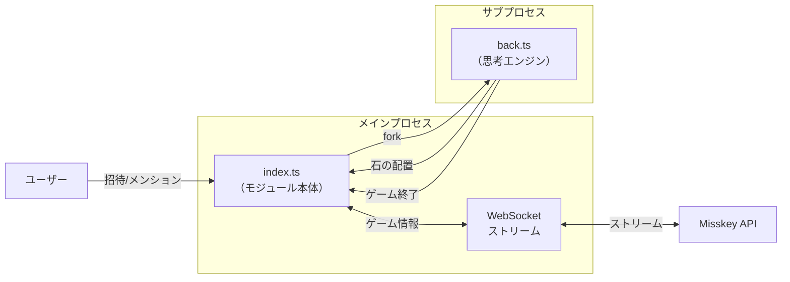

# reversi モジュール

Misskey のリバーシ（オセロ）対局機能を提供するモジュール。

> ⚠️ **現在このモジュールは実質無効化されています。**  
> `install()` 内の `if (true || !config.reversiEnabled)` により常に早期リターンし、
> メンションによる対局リクエストも辞退メッセージが返るのみです。

---

## アーキテクチャ

---

## ファイル構成

| ファイル | 行数 | 責務 |
| --- | --- | --- |
| `index.ts` | 181行 | モジュール本体。招待・マッチング・ゲーム管理・親愛度更新 |
| `back.ts` | 452行 | 思考エンジン。αβ法による探索・石の評価・手の決定 |

---

## 思考エンジン (back.ts)

| 項目 | 説明 |
| --- | --- |
| 探索アルゴリズム | αβ法（ミニマックス法の最適化） |
| 探索深度 | 強さ設定（0〜5）に応じて変動 |
| 評価関数 | 隅のスコア重み付け（隅±1000、隅隣接ペナルティ等） |

### 強さ設定

| 値 | ラベル | 説明 |
| --- | --- | --- |
| 0 | 接待 | わざと弱い手を打つ |
| 2 | 弱 | 少し弱い |
| 3 | 中 | 通常 |
| 4 | 強 | 強い |
| 5 | 最強 | 最も深く探索 |

---

## 親愛度変動

| アクション | 変動量 | 条件 |
| --- | --- | --- |
| 対局完了 | +1（実効 +5） | 1日1回のみ |

> ⚠️ モジュールが無効化されているため、この処理は現在実行されません。

---

## 依存関係

| 依存先 | 用途 |
| --- | --- |
| `child_process` | back.ts のサブプロセス起動 |
| `misskey-reversi` | リバーシのゲームロジック（盤面管理） |
| `request-promise-native` | API通信（back.ts 内） |
| `@/config` | `reversiEnabled` 設定の参照 |
