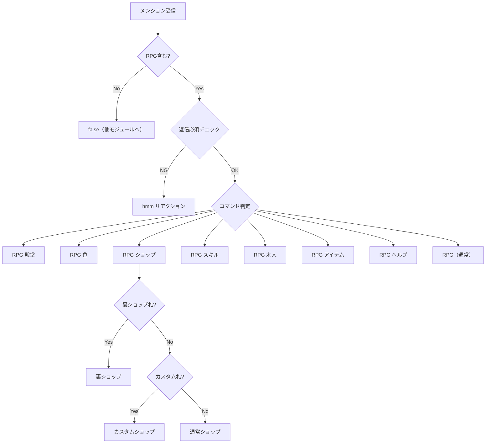
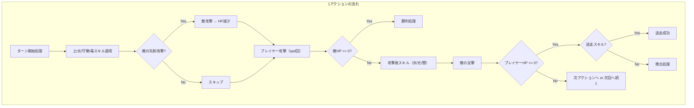

# rpg モジュール

RPGゲーム — メンションによって起動し、ターン制の戦闘・レベルアップ・アイテム収集・レイドボス討伐などを行うモジュール。
1日3回のプレイ枠（0〜11時 / 12〜17時 / 18〜23時）があり、毎回レベルが1上がる。

---

## 処理フロー（コマンド分岐）

---

## 通常RPGの戦闘フロー

`handleNormalCommands` の処理を順に示す。

### 1. データ初期化・スキル読み込み

- `initializeData` でプレイヤーデータを読み込み・正規化
- `aggregateSkillsEffects` で所持スキル効果を集計
- 数取りの達人スキルの履歴補完

### 2. プレイ可否判定・おかわり

- 時間帯ごとのプレイ文字列（`nowTimeStr`）を生成し、最終プレイ時刻と比較
- 既にプレイ済みの場合:
  - 「おかわり」キーワードがあれば、おかわり判定に入る
  - 1日1回の無料おかわり（過去に未プレイだった回数分）
  - コインを消費して追加おかわり（自動購入札所持で確認スキップ）
- 未プレイの場合はそのまま続行

### 3. 連続ボーナス・旅モード分岐

- 前回プレイとの時間差に応じて連続ボーナスを計算（1.0 / 0.5 / 0）
- 旅モード（エンドレスモード）のON/OFF判定
  - 「旅モード」キーワード or `autoJournal` 札で有効化
  - 敵が残っていない場合は自動的に旅モードへ
  - 既に敵と戦闘中で旅モード指定はエラー

### 4. 投稿数・倍率・基本変数初期化

- 色情報取得（解放条件チェック、覚醒色の判定）
- 覚醒判定: 2% + superPoint蓄積 or Lvが100の倍数 or 常時覚醒色
- 投稿数を取得し、ステータス倍率 `tp` を算出
  - 連続ボーナスで投稿数にボーナス加算
  - 覚醒時は +200 投稿数（hyperMode 時は代わりに postXUp 上昇）
  - 2ターン目以降は過去最大倍率の50%が保証される
- プレイヤーの基本ステータス（Lv, HP, チャージ, 最大HP）を初期化

### 5. 敵選択

- **新規戦闘の場合**（敵がいない or 1ターン目）:
  - 通常モード: 出現条件を満たす敵からランダム選択（未撃破優先）
  - 旅モード: `endressEnemy` を設定
  - 全敵撃破時: allClear 記録後、旅モードへ移行
- **継続戦闘の場合**（2ターン目以降）:
  - 敵データを再取得（関数データの復元）
  - 前ターンのステータスを表示
- 敵に独自イベント（`event`）がある場合はそちらに委譲

### 6. バフ処理

以下のバフが順に適用される:

| 順序 | バフ | 条件 |
| --- | --- | --- |
| 1 | 数取りの達人 | スキル所持時 |
| 2 | 情報表示解禁 | 最大HP 300以上到達時（1回のみ） |
| 3 | 連続ボーナス表示 | 連続プレイ時 |
| 4 | ステータス計算 | `calculateStats` で atk/def/spd を算出 |
| 5 | 覚醒 | 覚醒判定が真の場合、spd+2・パワー/防御超アップ（色モードで追加効果） |
| 6 | 天国か地獄か | スキル所持時、60%で上昇 / 40%で低下 |
| 7 | 7フィーバー | スキル所持時、Lv/atk/def の7並び度合いでバフ |
| 8 | 修行の成果 | Lv384超かつ旅モード時、7フィーバーより高ければ適用 |
| 9 | 速度アップ | spd 1→60%で+1、spd 2→20%で+1 |
| 10 | 風魔法 | スキル所持時、spd に応じて追加行動 |
| 11 | 非戦闘スキル | 戦闘でない場合のパワー/防御ボーナス |
| 12 | 決死の覚悟 | HP 1/7以下かつ敵との差が大きい場合、防御→攻撃変換 |

### 7. アイテム取得・使用

- HP割合が低いほどアイテム取得確率が上昇（基本40%〜100%）
- `firstTurnItem` スキルで1ターン目は確定取得
- アイテムタイプの選択はスキルで制御可能（`weaponSelect`, `armorSelect`, `foodSelect`）

| タイプ | 効果 |
| --- | --- |
| 武器（weapon） | パワー上昇（effect値に比例） |
| 防具（armor） | 防御上昇（effect値に比例） |
| 薬（medicine） | 失っているHPの一部を回復（effect値に比例） |
| 毒（poison） | 現在HPの一部を失う（覚醒時は半減） |

- 非戦闘/非物理戦闘の場合、武器/防具は `mind` 値でパワー/防御を上下させる

### 8. 敵ステータス計算・戦闘前準備

- 敵の atk/def を計算（Lv * 3.5 * 敵倍率、または関数指定）
- 「強敵と戦うのが好き」スキル: 撃破済み敵の強化（ステータス・速度上昇）
- 覚醒色5個以上解放: 撃破済み敵のステータス底上げ
- 敵ステータスボーナススキル: 敵が強いほど自身もバフ
- 貫通計算（`calculateArpen`）
- 油断しないスキル（1ターン目被ダメージ軽減）
- 粘り強いスキル（HP低下時被ダメージ軽減）

### 9. 戦闘ループ本体

`plusActionX` 回のアクションを繰り返す（通常は1回、スキルで増加）。
各アクション内の処理:

#### 敵の先制攻撃

- 敵の速度（`spd`）が未設定かつ戦闘タイプの場合に発生
- 予測ダメージが敵HPに対して大きい場合に確率で発動
- HP 0 でも `notEndure` でなければ食いしばりで HP 1 に

#### プレイヤー攻撃

- spd 回繰り返す（中断スキル `abort` で途中終了あり）
- 各攻撃: 乱数 * 攻撃力 * 倍率でダメージ算出
- クリティカル: (敵HP割合 - 自HP割合) の確率で発生
- 雷スキル: 行動回数が多いほど後半の攻撃が強くなる
- 1ターンの最大ダメージ制限（`maxdmg`）がある敵も存在
- 覚醒中は追加で炎攻撃スタック蓄積

#### 攻撃後スキル

| スキル | 効果 |
| --- | --- |
| 氷 | 確率で敵のターンをスキップ |
| 光 | 確率で敵の攻撃力を半減 |
| 闇 | 敵の速度を1にする or 敵の現在HPを半減 |

#### 敵の反撃

- 敵の速度（`spd`）回分の攻撃
- 食いしばり: 確率で HP 1 で生存（`endure` 回数に応じて確率変動）
- ナース: 低確率（1%）で全回復イベント

### 10. 勝利処理

- 通常モード: 敵の勝利メッセージ表示、クリア記録追加
- 旅モード: ステージ進行、ステージ100到達で全ステージクリア報酬
- 連勝カウント更新（1ターン勝利で+2）
- 次戦闘用のパラメータリセット

### 11. 敗北処理

- 逃走スキル: スキル数まで100%成功、以降は半減
- 通常モード: 連勝リセット、クリアリストリセット、リベンジ対象記録
- 旅モード: ステージ後退（最大3ステージ）
- 食いしばり成功率アップ
- 敗北ボーナス（ステータス微増）

### 12. レベルアップ・後処理

- Lv +1
- atk / def にランダム配分（基本合計7、確率で追加）
- 攻撃偏り補正: atk と def の差が大きいと低い方に寄りやすい
- 7フィーバー補正: ステージ100クリア済みかつ7並びが崩れる場合に補正
- お守り耐久減少
- コイン取得（5回プレイごとに5枚）
- スキル変更珠の取得（Lv閾値に応じて）
- 色解禁チェック

---

## レイド

タイムラインに投稿される討伐イベント。参加者全員で1体のレイドボスに挑む。

### レイドの流れ

1. **自動開始**: 下記スケジュールに従い自動開始（前回レイドから31分未満は開始しない）
2. **参加**: レイド投稿に「参加」と返信（RPGモードのプレイが1回以上必要）
3. **ダメージ計算**: 参加者ごとにスキル・ステータスに基づくダメージを算出
4. **終了**: 制限時間経過で終了、コイン報酬を全参加者に配布

### レイド開始スケジュール

| 条件 | 開始時刻 | 備考 |
| --- | --- | --- |
| 毎日 | 8:15 / 12:15 / 18:15 / 21:15 | 固定枠 |
| 月〜木 | ランダム1回（時: 6〜22時台から1つ、分: 0/20/30/50から1つ） | 日付+アカウントIDのシードで決定 |
| 土・日 | 10:15 / 15:15 | 週末追加枠 |
| 土・日 | 19:45 | 週末追加枠 |
| 金・土 | 22:45 | 夜間追加枠 |
| 毎月18日 / 月曜 / 木曜 | 19:45 | コンテスト開始 |

### レイドのダメージ計算パターン

| パターン | 関数 | 対象 |
| --- | --- | --- |
| 通常戦闘 | `getTotalDmg` | ほとんどのレイドボス |
| じゃんけん型 | `getTotalDmg2` | じゃんけんで勝敗を決める敵 |
| コンテスト型 | `getTotalDmg3` | スコアで競う敵 |

### レイド経験値

- レイドボスに5回参加でレイドレベルアップ
- レベルアップイベント時は毎回Lv255までレベルアップ

---

## 主な機能

### 木人モード

- `RPG 木人` で起動
- 木人（防御力 = Lv * 3.5）に対してダメージを計測
- Lvごとに1回まで、通常RPGとは別枠
- 最大ダメージを記録

### 旅モード

- `RPG 旅モード` で起動（敵がいない場合のみ指定可能）
- `endressEnemy` と連続で戦う、ステージが進むほど敵が強くなる
- 敗北するとステージが後退（最大3）
- ステージ100到達で全ステージクリア報酬（コイン1000枚 + 特別アイテム）

### おかわり

- `RPG おかわり` で起動
- 過去にRPGをプレイし忘れた回数分、無料で追加プレイ可能
- 1日1回の無料おかわり消費後、コインで追加購入も可能

### ショップ

- `RPG ショップ` で起動
- コインでアイテム（お守り・お札）を購入
- 1日1回ラインナップが変わる

### 裏ショップ

- `RPG 裏ショップ` で起動（裏ショップ入場の札が必要）
- コインとスキル変更珠で珍しいアイテムを購入

### カスタムショップ

- `RPG カスタムショップ` で起動（カスタムショップ入場の札が必要）
- お守りパーツを組み合わせて自分好みのお守りを作成

### スキル

- `RPG スキル` で確認・変更
- Lv20で最初のスキル習得、以降Lv閾値で追加スロット解放
- 変更珠でスキル入替、複製珠でスキル複製
- スキル効果は戦闘中の各種判定に影響

### 色

- `RPG 色` で確認・変更
- 条件を満たすと新しい色が解放
- 一部の色にはステータス反転・常時覚醒などの特殊効果あり

### 殿堂

- `RPG 殿堂` で確認
- Lv、木人ダメージ、旅モード最高記録、レイドスコア等のランキング表示

---

## メンションコマンド一覧

| コマンド | 説明 |
| --- | --- |
| `RPG` | 通常RPGを開始 |
| `RPG おかわり` | おかわりRPGを開始 |
| `RPG 木人` | 木人モードでダメージ計測 |
| `RPG 旅モード` | 旅モード（エンドレス）を開始 |
| `RPG ショップ` | ショップを開く |
| `RPG 裏ショップ` | 裏ショップを開く（入場札が必要） |
| `RPG カスタムショップ` | カスタムショップを開く（入場札が必要） |
| `RPG スキル` | スキル確認・変更 |
| `RPG 色` | 色の確認・変更 |
| `RPG アイテム` | 所持アイテム一覧 |
| `RPG 殿堂` | 記録・ランキング表示 |
| `RPG ヘルプ` | コマンド一覧表示 |

---

## 設定 (config.json)

| キー | 型 | デフォルト | 説明 |
| --- | --- | --- | --- |
| `rpgHeroName` | string | `もこチキ` | 主人公の名前 |
| `rpgCoinName` | string | `もこコイン` | 通貨の名前 |
| `rpgCoinShortName` | string | `コイン` | 通貨の短縮名 |
| `rpgReplyRequired` | boolean | `true` | RPGコマンドを返信必須にする |
| `rpgReplyVisibility` | string | — | RPGの返信の公開範囲 |
| `rpgRaidReplyVisibility` | string | — | レイドの返信の公開範囲 |

---

## ファイル構成

| ファイル | 説明 |
| --- | --- |
| `index.ts` | モジュール本体（mentionHook → 各コマンドハンドラ、通常RPG戦闘ロジック） |
| `battle.ts` | 戦闘補助計算（ステータス計算、貫通計算、数取りの達人効果） |
| `raid.ts` | レイドイベント（開始・終了・参加処理・ダメージ計算3パターン） |
| `skills.ts` | スキル定義・効果集計・スキル人気度計算 |
| `shop.ts` | ショップ（お守り・お札の定義と購入処理） |
| `shop2.ts` | 裏ショップ（レアアイテムの定義と購入処理） |
| `shop-custom.ts` | カスタムショップ（お守りパーツ組み合わせ） |
| `utils.ts` | データ初期化・ダメージ計算・ステータス表示等のユーティリティ |
| `enemys.ts` | 通常敵・レイド敵の定義 |
| `items.ts` | 戦闘中に取得するアイテム（武器/防具/薬/毒）の定義 |
| `colors.ts` | 色（着せ替え）の定義と解放条件 |

---

## 依存関係

| 依存先 | 用途 |
| --- | --- |
| `lokijs` | レイドデータの永続化 |
| `seedrandom` | シード付き乱数生成（ショップ等） |
| `autobind-decorator` | メソッドの自動バインド |
| `@/serifs` | 投稿セリフ |
| `@/friend` | ユーザーデータ・親愛度管理 |
| `@/config` | RPG設定値 |
| `@/vocabulary` | ランダムアイテム名生成 |
