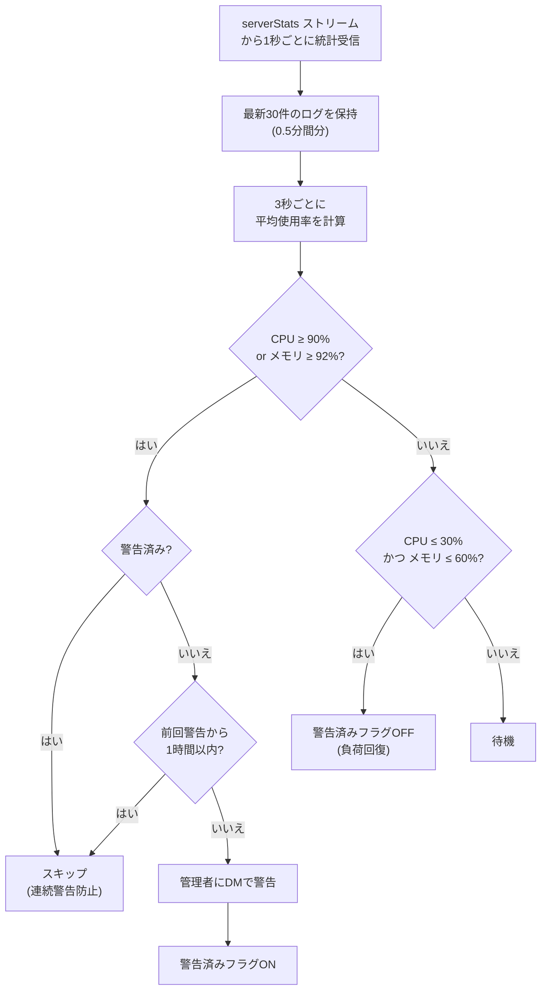

# server

Misskey サーバーの CPU・メモリ使用率をリアルタイム監視し、高負荷時に管理者へ警告DMを送信するモジュール。

## 動作フロー

## 仕様

| 項目 | 内容 |
|---|---|
| トリガー | `serverStats` WebSocket ストリーム |
| 監視間隔 | 統計受信: 1秒、チェック: 3秒 |
| ログ保持数 | 最新30件（約0.5分間） |
| 使用フック | なし（`install()` でストリーム購読） |
| 有効条件 | `config.serverMonitoring` が `true` |

### 閾値

| 状態 | 閾値 | アクション |
|---|---|---|
| 高負荷 | CPU平均 ≥ 90% **または** メモリ平均 ≥ 92% | 管理者にDM警告 |
| 負荷回復 | CPU平均 ≤ 30% **かつ** メモリ平均 ≤ 60% | 警告フラグ解除 |

### 連続警告の防止

1. **一度警告したら、負荷が回復するまで再警告しない**  
   常に負荷が高いサーバーで無限に警告が飛ぶのを防ぐ。
2. **前回警告から1時間以内は再警告しない**  
   短時間に何度も通知が飛ぶのを防ぐ。
