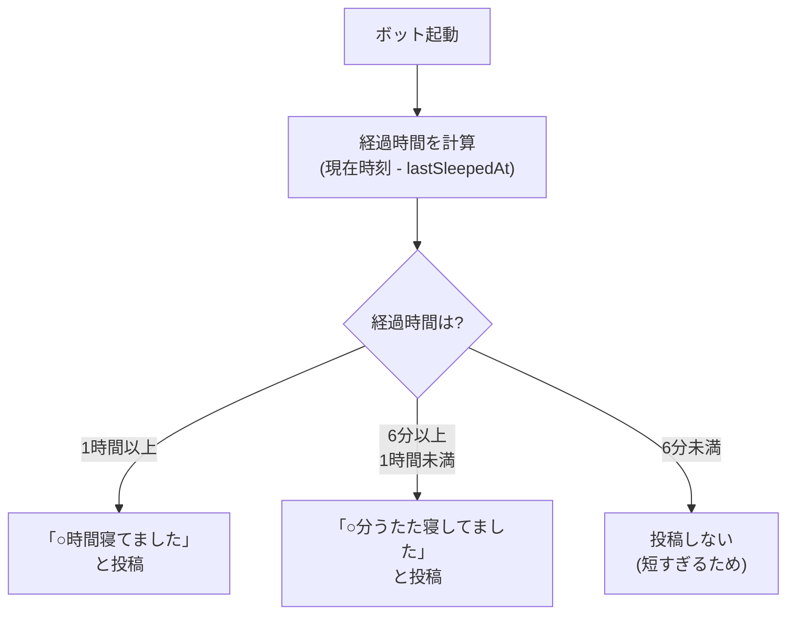

# sleep-report

ボット起動時に、前回のシャットダウンからの経過時間を「睡眠時間」として投稿するモジュール。

## 動作フロー

## 仕様

| 項目 | 内容 |
|---|---|
| トリガー | ボット起動時に1回だけ実行 |
| 判定基準 | `ai.lastSleepedAt`（前回シャットダウン時刻）からの経過時間 |
| 使用フック | なし（`install()` 内で直接実行） |
| DB使用 | なし |

### 投稿パターン

| 経過時間 | 投稿内容 | 例 |
|---|---|---|
| 1時間以上 | 時間単位で報告 | 「3時間寝てました」 |
| 6分〜59分 | 分単位で「うたた寝」として報告 | 「15分うたた寝してました」 |
| 6分未満 | 投稿しない | — |

> **NOTE:** 6分（0.1時間）未満の停止は、再起動やデプロイによる瞬間的な停止と見なし、報告しない。
