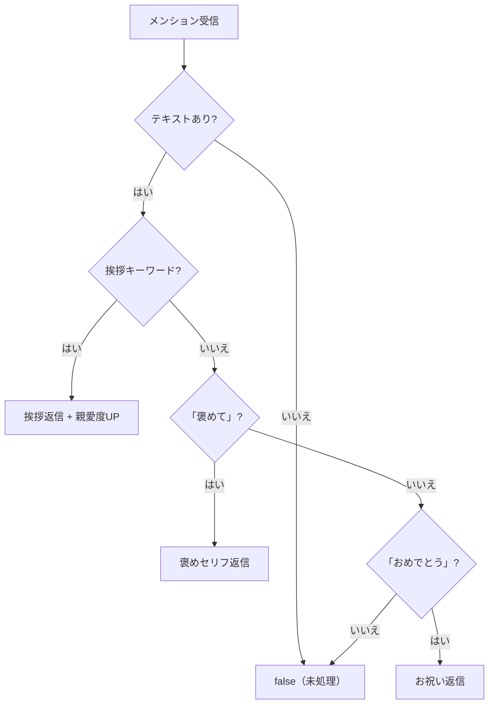

# talk モジュール

メンションに対して挨拶・褒め・おめでとう等の会話応答を行うモジュール。

---

## 処理フロー

---

## 有効なハンドラ

| ハンドラ | トリガー | 親愛度 | リアクション |
| --- | --- | --- | --- |
| greet | 日常あいさつ（おはよう/こんにちは/こんばんは等） | +0.6（実効+3）/ 1日1回 | ❤️（初回） / 👍（2回目以降） |
| erait | 「〇〇たから褒めて」「褒めて」 | — | ❤️ |
| omedeto | 「おめでとう」 | — | :mk_discochicken: |

---

## コメントアウト中のハンドラ

以下のハンドラは `mentionHook` 内でコメントアウトされており、現在は**無効**。関数定義は残っている。

| ハンドラ | トリガー | 親愛度変動 | 備考 |
| --- | --- | --- | --- |
| nadenade | なでなで | +1（実効+5）/ 1日1回 | 親愛度に応じた7段階の返答 |
| kawaii | かわいい / 可愛い | — | 3段階の返答 |
| suki | 好き / すき | — | 名前付き特別返答あり |
| hug | ぎゅ / むぎゅ / はぐ | — | 1分間のクールダウンあり |
| humu | 踏んで | — | 3段階の返答 |
| batou | 罵倒して / 罵って | — | 3段階の返答 |
| itai | 痛い / いたい | — | — |
| ote | お手 | — | 3段階の返答 |
| ponkotu | ぽんこつ | -1（実効-5） | angry リアクション |
| rmrf | rm -rf | -1（実効-5） | angry リアクション |
| shutdown | shutdown | — | confused リアクション |

---

## 挨拶の詳細

| キーワード | 返信セリフの種類 | 備考 |
| --- | --- | --- |
| おは / おっは / お早う | goodMorning | テンション（`！` の数）が反映される |
| こんにちは / こんにちわ | hello | — |
| こんばんは / こんばんわ | helloNight | — |
| おやすみ / お休み | goodNight | — |
| 行ってくる / 行ってきます | itterassyai | — |
| ただいま | okaeri | — |
| ありがとう | arigatou | — |

---

## 依存関係

| 依存先 | 用途 |
| --- | --- |
| `@/serifs` | 全セリフ定義（`serifs.core.*`） |
| `@/utils/get-date` | 日付取得（1日1回制限） |
| `@/message` | メッセージ解析・返信 |
