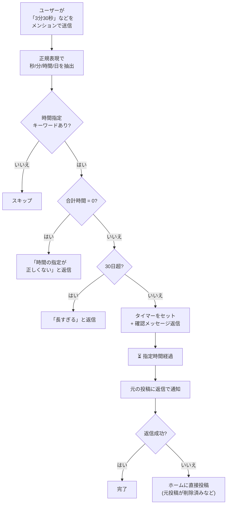

# timer

メンションで時間を指定すると、指定時間後にリプライで通知するタイマー機能。

## 動作フロー

## 仕様

| 項目 | 内容 |
|---|---|
| トリガー | メンションに `〇秒`, `〇分`, `〇時間`, `〇日` が含まれる |
| 最大時間 | 30日（2,592,000,000ミリ秒） |
| 通知方法 | 元の投稿への返信（失敗時はホームに投稿） |
| 通知の公開範囲 | `home` |
| 永続化 | あり（プロセス再起動後もタイマーが有効） |
| 使用フック | `mentionHook`, `timeoutCallback` |

### 入力例

| 入力 | タイマー時間 |
|---|---|
| `3分` | 3分 |
| `1時間30分` | 1時間30分 |
| `2日5時間` | 2日5時間 |
| `90秒` | 90秒 |
| `31日` | 拒否（30日超） |
| `0分` | 無効 |

### 永続化について

タイマーは `setTimeoutWithPersistence` を使用してDBに保存される。  
ボットが途中で再起動しても、残り時間が経過すれば通知が届く。
