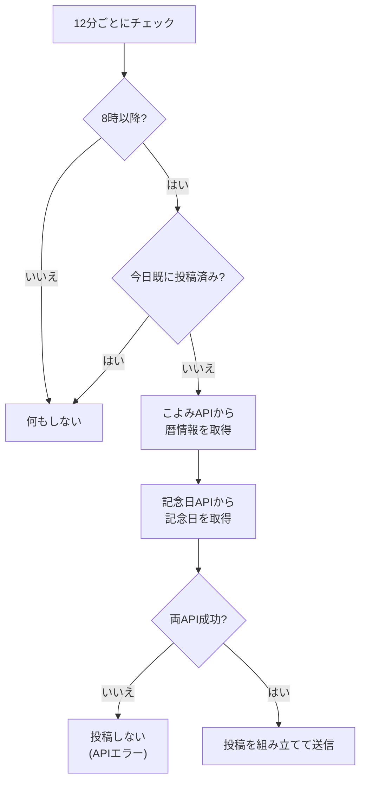

# today

毎日8時以降に、その日の暦情報（曜日、元号、祝日、記念日、六曜など）を投稿するモジュール。

## 動作フロー



## 仕様

| 項目 | 内容 |
| --- | --- |
| トリガー | 12分間隔のポーリング（8時以降） |
| 投稿頻度 | 1日1回のみ（`lastPosted` で管理） |
| 使用フック | なし（`install()` でタイマー設定） |

### 投稿に含まれる情報

| 情報 | ソース |
| --- | --- |
| 日付（元号表記） | こよみAPI |
| 曜日 | こよみAPI |
| 祝日 | こよみAPI |
| 二十四節気 | こよみAPI |
| 六曜（大安、仏滅等） | こよみAPI |
| 一粒万倍日 | こよみAPI |
| 天赦日 | こよみAPI |
| 大明日 | こよみAPI |
| 記念日（最大5件） | 記念日API |
| 月×日の計算値 | 自前計算 |

### 外部API

| API | URL | 用途 |
| --- | --- | --- |
| こよみAPI | `https://koyomi.zingsystem.com/api/` | 暦情報全般 |
| 記念日API | `https://api.whatistoday.cyou/v3/anniv/` | その日の記念日 |

### 挨拶の時間帯

| 時間帯 | 挨拶 |
| --- | --- |
| 8:00〜11:59 | おはようございます！ |
| 12:00〜17:59 | こんにちは！ |
| 18:00〜23:59 | こんばんは！ |

### 投稿例

```text
おはようございます！
令和8年2月13日 木曜日

- 建国記念の日
- 世界ラジオデー
- 苗字制定記念日
- 六曜: 大安
- 一粒万倍日
- 月×日: 26
```
