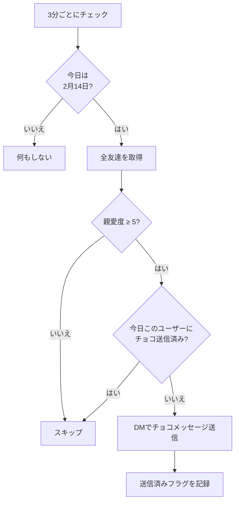

# valentine

2月14日（バレンタインデー）に、親愛度が高い友達にチョコレートメッセージをDMで送るモジュール。

## 動作フロー

## 仕様

| 項目 | 内容 |
| --- | --- |
| トリガー | 3分間隔のポーリング |
| 対象日 | 2月14日のみ |
| 対象ユーザー | 親愛度5以上の友達 |
| 送信方法 | DM（`sendMessage`） |
| 重複防止 | モジュール固有データの `lastChocolated` に日付を記録 |
| 使用フック | なし（`install()` でタイマー設定のみ） |

### 親愛度の目安

| 親愛度 | 星レベル | チョコ |
| --- | --- | --- |
| 0〜4 | ☆1〜☆2 | もらえない |
| 5以上 | ☆3以上 | もらえる |
