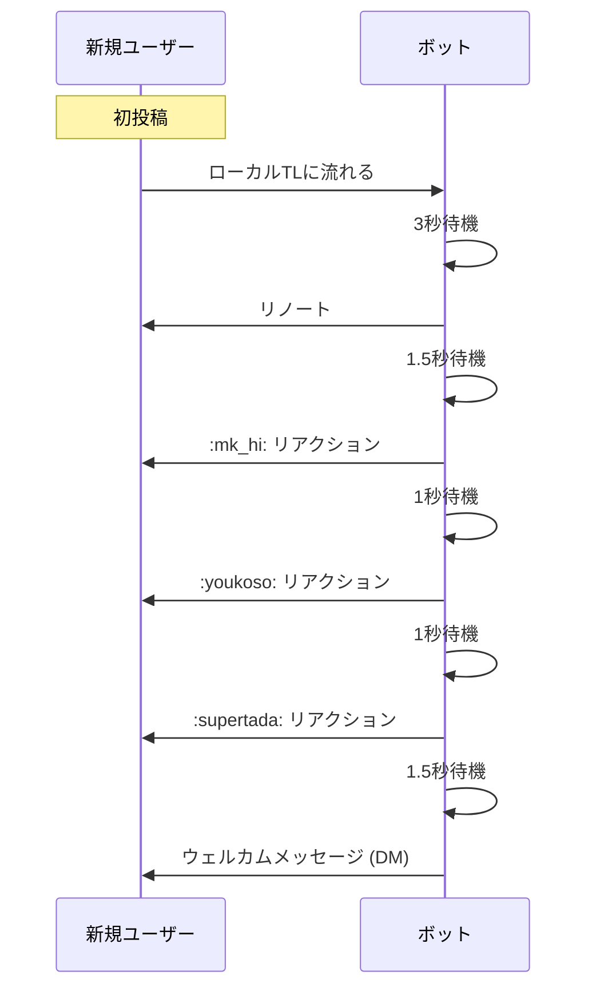
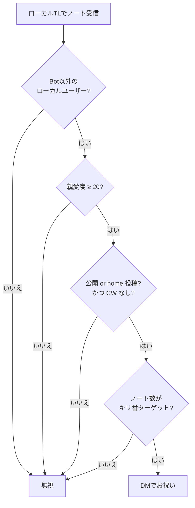

# welcome

新規ユーザーの初投稿を祝い、キリ番投稿を通知するモジュール。

## 機能概要

1. **初投稿祝い**: 初めて投稿したユーザーをリノート＋リアクション＋メッセージで歓迎
2. **キリ番通知**: 特定のノート数に達したユーザーに通知

---

## 1. 初投稿祝い

### 初投稿の判定条件

- `isFirstNote` フラグが `true`
- **または** ノート数が50以下（初投稿フラグがない場合のフォールバック）
- 一度送信したユーザーには再送しない（`isWelcomeMessageSent` フラグで管理）

---

## 2. キリ番通知

### キリ番ターゲット

| ノート数 | 説明 |
|---|---|
| 50 | |
| 100 | |
| 500 | |
| 1,000 | |
| 5,000 | |
| 10,000, 15,000, ... | 5,000刻みで継続 |

## 仕様

| 項目 | 内容 |
|---|---|
| トリガー | ローカルTLのノートイベント |
| 初投稿祝い対象 | Bot以外のローカルユーザー |
| キリ番対象 | 親愛度20以上 + 公開/home投稿 + CWなし |
| 使用フック | なし（ストリームイベント直接購読） |
