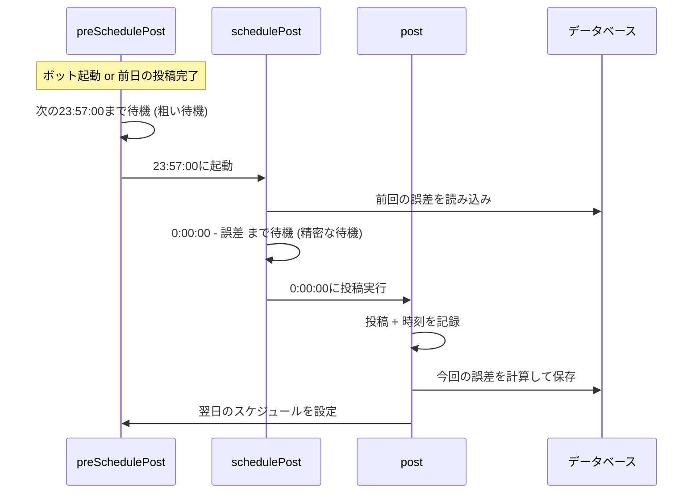

# yoruho

毎日0時00分00秒ちょうどに「夜報」を投稿するモジュール。  
投稿時刻のずれを計測して次回に自動補正することで、可能な限り正確なタイミングを狙う。

## タイミング制御

### なぜ2段階？

`setTimeout` は長時間のタイマーほど誤差が大きくなる。  
そのため、以下の2段階で精度を確保している:

| 段階 | メソッド | 待機先 | 目的 |
|---|---|---|---|
| 1 | `preSchedulePost` | 23:57:00 | 長時間の粗い待機（誤差許容） |
| 2 | `schedulePost` | 0:00:00 | 3分間の精密な待機（前回誤差で補正） |

### 誤差補正の仕組み

1. 投稿後、Misskey サーバーが返す `createdAt` から実際の投稿時刻を取得
2. 0:00:00 からどれだけずれたかを計算（誤差）
3. 前回の誤差と今回の誤差を平均して DB に保存
4. 次回のスケジューリング時にこの誤差を反映

| 条件 | 処理 |
|---|---|
| 誤差が ±1秒以内 | 前回の誤差と平均して保存 |
| 誤差が ±1秒超 | 異常値とみなしリセット（0に） |
| 前回の誤差が正（投稿が早すぎた） | -50ms にリセット |

## 特殊日の投稿

| 日付 | 投稿内容 |
|---|---|
| 1月1日 | 新年の挨拶（`serifs.yoruho.newYear`） |
| 4月1日 | エイプリルフール投稿（`serifs.yoruho.aprilFool`） |
| その他 | 通常の夜報（`serifs.yoruho.yoruho`） |

## 仕様

| 項目 | 内容 |
|---|---|
| トリガー | 内部タイマー（起動時に自動設定） |
| 投稿頻度 | 毎日0時に1回 |
| 公開範囲 | ローカル限定（`localOnly: true`） |
| activeFactor | 投稿のたびに 0.015 減少 |
| DB使用 | `moduleData`（`yoruhoTime` 型）に誤差を保存 |
| 使用フック | なし |
